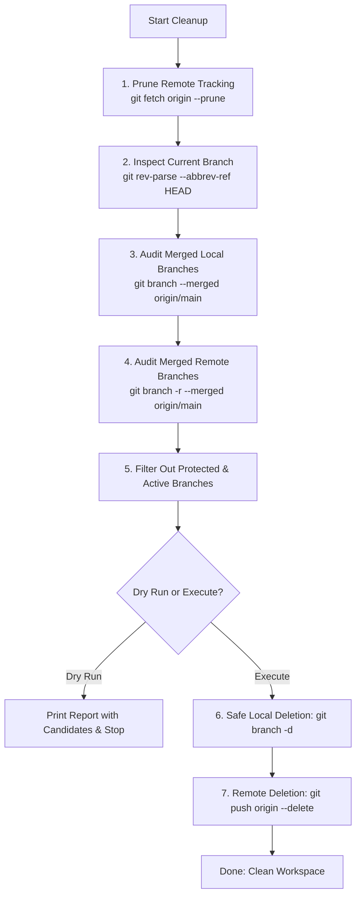

# Git Branch Cleanup Skill

The **branch-cleanup** skill automates and safeguards the audit, pruning, and deletion of merged and stale Git branches across both **local** and **remote** repositories. It prevents branch sprawl and keeps repository workflows fast and clutter-free while guaranteeing that active work and protected production branches are never lost.

---

## 🛡️ Core Safety Guardrails

Every branch cleanup operation MUST enforce the following safeguards:

1. **Protected Branches Inviolability**:
   The following branch names and patterns must **NEVER** be deleted locally or remotely:
   - `main`, `master`
   - `develop`, `dev`
   - `staging`, `production`, `prod`
   - `release/*`
   - The currently checked-out active branch (`HEAD`)
2. **Dry-Run by Default**:
   Always execute an audit / dry-run preview first to list branches slated for removal before deleting anything.
   Ensure the user or engineer explicitly reviews the candidate list.
3. **Safe Local Deletion First (`-d` before `-D`)**:
   Always attempt `git branch -d <branch>` first, which relies on Git's internal merge check to prevent deleting unmerged commits. Use `-D` only when verifying squashed PR merges.
4. **Remote-Tracking Pruning**:
   Always run `git fetch origin --prune` before auditing remote branches so that deleted remote branches are reflected in local tracking refs.

---

## 🔍 Detection & Deletion Workflow



---

## 💻 Automated Companion Script

A zero-dependency helper script is provided at:
`.agents/skills/branch-cleanup/scripts/cleanup-branches.mjs`

### CLI Usage Examples:

```bash
# 1. Preview candidates (Dry Run - completely safe, no changes made)
node .agents/skills/branch-cleanup/scripts/cleanup-branches.mjs --dry-run

# 2. Clean only local merged branches
node .agents/skills/branch-cleanup/scripts/cleanup-branches.mjs --local

# 3. Clean only remote merged branches on origin
node .agents/skills/branch-cleanup/scripts/cleanup-branches.mjs --remote

# 4. Clean both local and remote merged branches
node .agents/skills/branch-cleanup/scripts/cleanup-branches.mjs --all

# 5. Specify custom target branch or remote (default: origin/main)
node .agents/skills/branch-cleanup/scripts/cleanup-branches.mjs --target main --remote-name origin
```

---

## 🛠️ Native Git Terminal Commands

If executing commands directly in PowerShell or Bash:

### 1. Prune Stale Remote-Tracking References
Removes references to remote branches that were already deleted on GitHub:
```bash
git fetch origin --prune
```

### 2. Audit Local Merged Branches
```bash
# List local branches merged into origin/main (excluding main and current branch)
git branch --merged origin/main | grep -v "^\*" | grep -v "main"
```

### 3. Delete Local Merged Branches
#### PowerShell (Windows):
```powershell
git branch --merged origin/main | ForEach-Object { $_.Trim() } | Where-Object { $_ -notmatch '^\*' -and $_ -ne 'main' -and $_ -ne 'master' -and $_ -ne 'develop' } | ForEach-Object { git branch -d $_ }
```

#### Bash / macOS / Linux:
```bash
git branch --merged origin/main | grep -v "^\*" | grep -Ev "(main|master|develop)" | xargs -n 1 git branch -d
```

### 4. Delete Remote Merged Branches
```bash
# Delete a specific remote branch
git push origin --delete <branch-name>
```

#### PowerShell (Windows batch delete):
```powershell
git branch -r --merged origin/main | ForEach-Object { $_.Trim() } | Where-Object { $_ -match '^origin/' -and $_ -notmatch 'HEAD|main|master|develop' } | ForEach-Object { $branch = $_ -replace '^origin/', ''; git push origin --delete $branch }
```

---

## 🧩 Edge Cases & Handling

### 1. Squash-Merged Pull Requests
When GitHub merges a Pull Request via "Squash and merge", the individual commits are squashed into a single commit with a new SHA on `main`. Because the commit hashes differ, standard `git branch --merged` might not recognize the branch as merged.
- **Verification**: Run `git log origin/main --grep="<branch-slug>"` or `git log origin/main --grep="#<PR-number>"` to verify the squash merge.
- **Local Removal**: Once verified, use `git branch -D <branch>` to delete the local branch safely.

### 2. Detached HEAD
If the repository is in a detached HEAD state (`git status` reports `HEAD detached at ...`), switch back to `main` before running cleanup:
```bash
git checkout main
```

### 3. Active Feature Branch
If you are currently working on a feature branch, cleanup automatically preserves it. Never delete a branch that has uncommitted working tree changes.

---

## 📋 Verification Checklist

Before and after running branch cleanup:
- [x] Run `git status` to verify working tree is clean.
- [x] Run `git fetch origin --prune` to refresh remote status.
- [x] Verify `main` remains intact and checkoutable.
- [x] Check `git branch` to ensure only active work remains.
