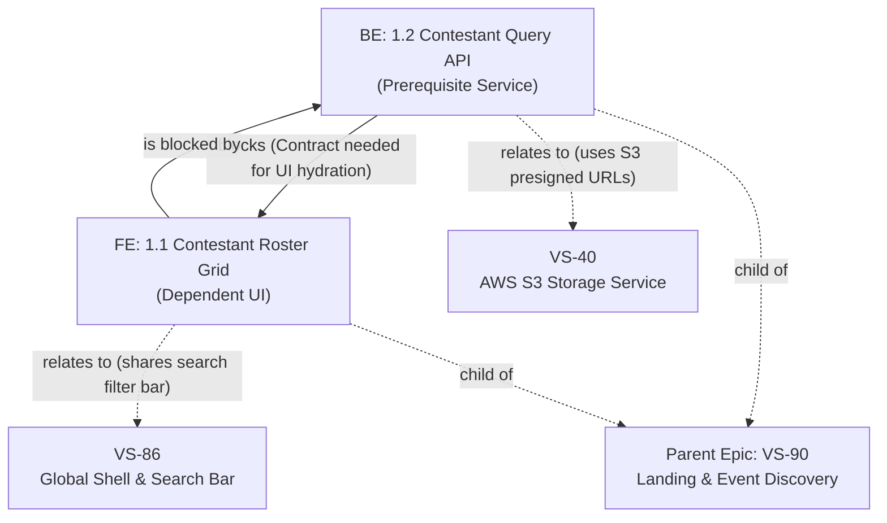

# Jira Ticket Creator & Dependency Linker

The **jira-ticket** skill converts feature requirements, epics, and specifications into production-grade, delivery-ready Jira tickets. It pairs with the [**user-story**](file:///c:/Users/Roselle%20Tabuena/workspace/electa-workspace/.agents/skills/user-story/SKILL.md) skill to ensure exceptional narrative and acceptance criteria quality, strictly enforces frontend/backend title nomenclature, posts the tickets directly to Jira under the active project (default: `VS`), links parent Epics, establishes formal blocking relationships (`Blocks` with explicit blocking rationale), and maps contextual connections (`Relates` to related components, services, or specs).

---

## 🎯 Purpose & Capabilities

1. **Integrated User Story Quality**: Automatically triggers the [**user-story**](file:///c:/Users/Roselle%20Tabuena/workspace/electa-workspace/.agents/skills/user-story/SKILL.md) skill to draft Mike Cohn use cases (`As a... I want to... so that...`) with specific personas and Gherkin acceptance criteria (`Given... When... Then...`).
2. **Structured Ticket Creation**: Decomposes high-level requirements into clean, single-purpose Frontend (`FE`) and Backend (`BE`) stories.
3. **Strict Title Standard**: Enforces the required numbering format:
   - **Frontend**: `FE: 1.1 title of the ticket`
   - **Backend**: `BE: 1.2 title of the ticket`
4. **Automated Dependency & Relation Graphing**:
   - **Blocks (`10000`)**: Connects prerequisite backend API/database tickets to downstream frontend consumers, with an **explicit blocking reason** recorded in both the Jira link comment and the ticket body.
   - **Relates (`10003`)**: Connects tickets to relevant sibling features, shared UI components, external services (e.g., AWS S3, Cognito, PayMongo), or design spikes.
   - **Parent Epic (`parent`)**: Associates tickets to the overarching Epic roadmap.
5. **Electa Constitution Compliance**: Ensures all created tickets enforce Electa Constitutional principles (§I–§VI), including zero-radius Brutalist geometry, Opal light theme default, WCAG 2.1 AA accessibility, and typed API envelopes (`ApiResponse<T>`).

---

## 🤝 Synergy with the `user-story` Skill

> [!IMPORTANT]
> **Always trigger and follow the [`user-story`](file:///c:/Users/Roselle%20Tabuena/workspace/electa-workspace/.agents/skills/user-story/SKILL.md) skill when drafting story content.**
> Never write generic or low-signal descriptions. Every Jira ticket created through this skill must apply the Mike Cohn and Gherkin quality standards from `user-story/SKILL.md`.

### Core Quality Rules Inherited from `user-story`:

1. **Persona Specificity**:
   - ❌ Never use generic *"As a user"*.
   - ✅ Use clear roles: *"As an event voter"*, *"As a pageant organizer"*, *"As a pageant judge"*, *"As a platform admin"*, or *"As an autonomous AI agent / developer"*.
2. **True Outcome Motivation**:
   - ❌ Avoid restating the action: *"so that I can click save"*.
   - ✅ Capture the actual business or user outcome: *"so that I don't lose scored candidate ballots if the browser disconnects"*.
3. **Rigorous Gherkin Scenarios**:
   - **Multiple `Given`s are encouraged**: Stack preconditions (e.g. `Given an organizer is on the live console`, `and Given the pageant has started`).
   - **Exactly ONE `When` per scenario**: If multiple actions are needed, split the story.
   - **Exactly ONE `Then` per scenario**: Must be concrete and verifiable (e.g., `Then the leaderboard refreshes in under 500ms`, NOT `Then the user is happy`).
   - **Cover 3 Scenarios**: Happy Path, Validation/Error Handling, and Edge Case/Mobile Viewport.

---

## 🏷️ Mandatory Title Format

Every ticket summary posted to Jira **MUST** strictly adhere to the following naming pattern:

```text
FE: <Major>.<Minor> <Descriptive Title>
BE: <Major>.<Minor> <Descriptive Title>
```

### Format Specification
- **Prefix**: Exactly `FE:` for frontend or `BE:` for backend/tooling/platform, followed by a single space.
- **Numbering**: `<Major>.<Minor>` where:
  - `<Major>` is the feature/milestone index (e.g. `1`, `2`, `3`).
  - `<Minor>` is the sequential ticket counter within that group (e.g. `1.1`, `1.2`, `1.3`).
- **Title**: Clear, imperative summary of what the ticket implements.

### Format Regex
```regex
^(FE|BE):\s*\d+\.\d+\s+.+$
```

### Canonical Examples
| Role | Title | Description |
| :--- | :--- | :--- |
| **Frontend** | `FE: 1.1 Contestant Roster Grid & Category Filter Bar` | UI component consuming contestant data |
| **Backend** | `BE: 1.2 Contestant Query Route & Prisma Read Service` | API endpoint providing contestant payload |
| **Backend** | `BE: 1.3 Unified Agent Verification CLI & Vitest Feedback` | Developer tooling & verification automation |
| **Frontend** | `FE: 1.4 Real-Time Leaderboard Mystery Freeze Display` | UI display showing live ranks and mystery state |

---

## 🔗 Dependency Linking & Relationship Protocol



### 1. "Blocks" Dependency (`linkType: "Blocks"`)
Use when Ticket A is a hard technical prerequisite for Ticket B.
- **Inward Issue**: The blocker/prerequisite (e.g., `BE: 1.2` / `VS-102`).
- **Outward Issue**: The blocked item (e.g., `FE: 1.1` / `VS-101`).
- **Comment (Why it blocks)**: Always include an explicit reason explaining what makes it block.
  - *Example reason*: `"Blocks FE: 1.1 because frontend hydration and React Query hooks depend on the GET /api/v1/contestants endpoint and its Zod/TypeScript response schema."*
- **MCP Call**:
  ```json
  {
    "cloudId": "<cloudId>",
    "name": "createJiraIssueLink",
    "inputs": {
      "linkType": "Blocks",
      "inwardIssue": "VS-102",
      "outwardIssue": "VS-101",
      "comment": "Frontend implementation is blocked by backend API contract and Prisma data access service."
    }
  }
  ```

### 2. "Relates" Relationship (`linkType: "Relates"`)
Use when two tickets are contextually connected, share common primitives, or coordinate with external systems without hard execution blocking:
- **Common use cases**:
  - UI component shares design tokens or navigation shell from `VS-86` (Global Shell).
  - Backend route integrates with media assets managed by `VS-40` (AWS S3).
  - Feature coordinates with authentication managed by `VS-55` (AWS Cognito).
- **MCP Call**:
  ```json
  {
    "cloudId": "<cloudId>",
    "name": "createJiraIssueLink",
    "inputs": {
      "linkType": "Relates",
      "inwardIssue": "VS-101",
      "outwardIssue": "VS-86",
      "comment": "Reuses global search and filter pill primitives defined in VS-86."
    }
  }
  ```

### 3. Parent Epic Linking
Set the `parent` property in `createJiraIssue` to attach the ticket directly to the parent Epic (e.g., `parent: "VS-90"`).

---

## 📋 Standard Story Description Template

Use this markdown template for every ticket created via `createJiraIssue`:

```markdown
### 📖 User Story

**As a** [specific user persona / role],
**I want to** [perform a clear action / access capability],
**so that** [achieve a tangible business or user value].

---

### 🔍 Context & Problem Statement

[Brief 1-2 sentence background explaining the user need or friction being solved.]

---

### 🛠️ Technical Scope & Architecture

- **Layer**: [Frontend UI Component | Backend API Route | Prisma Service | Tooling]
- **Target Files / Directories**:
  - `src/features/<feature>/components/...`
  - `src/app/api/...`
- **Architectural Constraints**:
  - Default Light Mode (`#F8FAFC`), strict zero-radius (`rounded-none`).
  - Strict Zod validation & typed `ApiResponse<T>` envelope.
  - Server state via TanStack Query; session state via `auth-store`.

---

### 🔗 Issue Links & Relationships

| Relationship | Linked Ticket | Rationale / What Makes It Block |
| :--- | :--- | :--- |
| **Blocks** | `FE: 1.1 (VS-101)` | Blocks UI integration until endpoint schema is verified. |
| **Blocked By** | `BE: 1.2 (VS-102)` | Cannot hydrate live data until API endpoint returns JSON. |
| **Relates To** | `VS-86` | Reuses global search and filter bar primitives. |
| **Relates To** | `VS-40` | Uses AWS S3 storage presigned URLs for image assets. |

---

### ✅ Acceptance Criteria (Gherkin Scenarios)

#### Scenario 1: Happy Path
- **Given** [preconditions]
- **When** [trigger event]
- **Then** [expected concrete outcome]

#### Scenario 2: Validation & Error Handling
- **Given** [preconditions]
- **When** [invalid input / error trigger]
- **Then** [expected error state or fallback]

#### Scenario 3: Edge Case / Viewport Adaptation
- **Given** [boundary condition]
- **When** [trigger event]
- **Then** [expected behavior]

---

### 🛡️ Quality Gate & Definition of Done

- [ ] Strict TypeScript 5 (no `any`, no non-null assertions `!`)
- [ ] Vitest unit tests pass (`npm run test:unit`)
- [ ] WCAG 2.1 AA color contrast verified in both Light and Dark modes
- [ ] Passes typecheck (`npm run typecheck`) and linter (`npm run lint`)
```

---

## 🚀 Execution Steps for the Agent

When the user asks to create tickets or user stories for a feature or epic:

1. **Trigger `user-story` Skill**: Formulate high-quality user story narratives following Mike Cohn format (`As a... I want to... so that...`) and testable Gherkin scenarios (`Given... When... Then...`).
2. **Plan & Decompose**: Divide feature into `FE` and `BE` tickets with titles matching `FE: <Major>.<Minor> ...` / `BE: <Major>.<Minor> ...`.
3. **Determine Technical Dependencies**:
   - Identify prerequisite tickets that block dependent tickets and document the **blocking reason**.
   - Identify sibling/shared components and document the **relationship context**.
4. **Retrieve Site Context**: Call `getAccessibleAtlassianResources` once to retrieve `cloudId`.
5. **Post Tickets to Jira**: Call `createJiraIssue` for each ticket with `projectKey: "VS"`, populated 6-section description, and `parent` Epic key.
6. **Execute Issue Links**:
   - For blocking dependencies: Call `executeWrite` with operation `createJiraIssueLink` (`linkType: "Blocks"`).
   - For contextual relations: Call `executeWrite` with operation `createJiraIssueLink` (`linkType: "Relates"`).
7. **Sync Local Documentation**: Update the feature/epic specification file (e.g. `docs/epics/EPIC-*.md`) with the newly generated Jira keys and dependency matrix.
8. **Report to User**: Present a comprehensive summary table with keys, titles, parent links, and dependency relationships.
