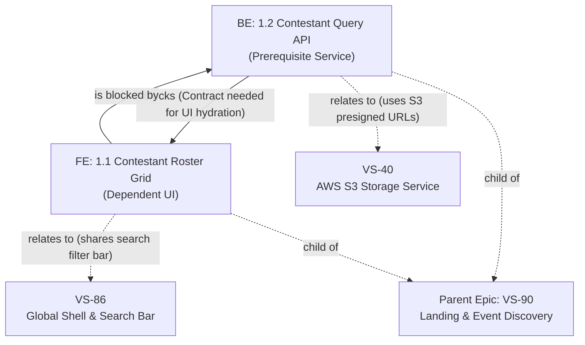

# Jira Ticket Creator & Dependency Linker

The **jira-ticket** skill converts feature requirements, user stories, or specification files into production-grade, delivery-ready Jira tickets. It strictly enforces frontend/backend title nomenclature, posts the tickets directly to Jira under the active project (default: `VS`), links parent Epics, establishes formal blocking relationships (`Blocks` with explicit blocking rationale), and maps contextual connections (`Relates` to related components, services, or specs).

---

## 🎯 Purpose & Capabilities

1. **Structured Ticket Creation**: Decomposes high-level requirements into clean, single-purpose Frontend (`FE`) and Backend (`BE`) user stories.
2. **Strict Title Standard**: Enforces the required numbering format:
   - **Frontend**: `FE: 1.1 title of the ticket`
   - **Backend**: `BE: 1.2 title of the ticket`
3. **Automated Dependency & Relation Graphing**:
   - **Blocks (`10000`)**: Connects prerequisite backend API/database tickets to downstream frontend consumers, with an **explicit blocking reason** recorded in both the Jira link comment and the ticket body.
   - **Relates (`10003`)**: Connects tickets to relevant sibling features, shared UI components, external services (e.g., AWS S3, Cognito, PayMongo), or design spikes.
   - **Parent Epic (`parent`)**: Associates tickets to the overarching Epic roadmap.
4. **Electa Constitution Compliance**: Ensures all created tickets enforce Electa Constitutional principles (§I–§VI), including zero-radius Brutalist geometry, Opal light theme default, WCAG 2.1 AA accessibility, and typed API envelopes (`ApiResponse<T>`).

---

## 🏷️ Mandatory Title Format

Every ticket summary posted to Jira **MUST** strictly adhere to the following naming pattern:

```text
FE: <Major>.<Minor> <Descriptive Title>
BE: <Major>.<Minor> <Descriptive Title>
```

### Format Specification
- **Prefix**: Exactly `FE:` for frontend or `BE:` for backend, followed by a single space.
- **Numbering**: `<Major>.<Minor>` where:
  - `<Major>` is the feature/milestone index (e.g. `1`, `2`, `3`).
  - `<Minor>` is the sequential ticket counter within that group (e.g. `1.1`, `1.2`, `1.3`).
- **Title**: Clear, imperative summary of what the ticket implements.

### Format Regex
```regex
^(FE|BE):\s*\d+\.\d+\s+.+$
```

### Canonical Examples
| Role | Title | Description |
| :--- | :--- | :--- |
| **Frontend** | `FE: 1.1 Contestant Roster Grid & Category Filter Bar` | UI component consuming contestant data |
| **Backend** | `BE: 1.2 Contestant Query Route & Prisma Read Service` | API endpoint providing contestant payload |
| **Frontend** | `FE: 1.3 Real-Time Leaderboard Mystery Freeze Display` | UI display showing live ranks and mystery state |
| **Backend** | `BE: 1.4 Leaderboard Aggregation Cache & Freeze Window API` | Database aggregation queries & freeze cutoff logic |

---

## 🔗 Dependency Linking & Relationship Protocol



### 1. "Blocks" Dependency (`linkType: "Blocks"`)
Use when Ticket A is a hard technical prerequisite for Ticket B.
- **Inward Issue**: The blocker/prerequisite (e.g., `BE: 1.2` / `VS-102`).
- **Outward Issue**: The blocked item (e.g., `FE: 1.1` / `VS-101`).
- **Comment (Why it blocks)**: Always include an explicit reason explaining what makes it block.
  - *Example reason*: `"Blocks FE: 1.1 because frontend hydration and React Query hooks depend on the GET /api/v1/contestants endpoint and its Zod/TypeScript response schema."*
- **MCP Call**:
  ```json
  {
    "cloudId": "<cloudId>",
    "name": "createJiraIssueLink",
    "inputs": {
      "linkType": "Blocks",
      "inwardIssue": "VS-102",
      "outwardIssue": "VS-101",
      "comment": "Frontend implementation is blocked by backend API contract and Prisma data access service."
    }
  }
  ```

### 2. "Relates" Relationship (`linkType: "Relates"`)
Use when two tickets are contextually connected, share common primitives, or coordinate with external systems without hard execution blocking:
- **Common use cases**:
  - UI component shares design tokens or navigation shell from `VS-86` (Global Shell).
  - Backend route integrates with media assets managed by `VS-40` (AWS S3).
  - Feature coordinates with bot mitigation from `VS-18` (Cloudflare Turnstile).
- **MCP Call**:
  ```json
  {
    "cloudId": "<cloudId>",
    "name": "createJiraIssueLink",
    "inputs": {
      "linkType": "Relates",
      "inwardIssue": "VS-101",
      "outwardIssue": "VS-86",
      "comment": "Reuses global search and filter pill primitives defined in VS-86."
    }
  }
  ```

### 3. Parent Epic Linking
Set the `parent` property in `createJiraIssue` to attach the ticket directly to the parent Epic (e.g., `parent: "VS-90"`).

---

## 💡 What to Include When Creating a Jira User Story

A high-quality, production-ready Jira User Story must answer **who**, **what**, **why**, **how it links**, and **how to prove it works**. Always include these 6 core sections:

### 1. Title & Executive Summary
- Strictly formatted title (`FE: 1.1 ...` or `BE: 1.2 ...`).
- One-line summary stating the concrete problem and delivery goal.

### 2. User Story (Mike Cohn Format)
```text
As a [specific user persona / role],
I want to [perform a clear action / access capability],
so that [achieve a tangible business or user value].
```
*Avoid generic roles like "As a user"; use "As an event organizer", "As a voter", "As a pageant judge", or "As a platform admin".*

### 3. Technical Scope & Architecture Bounds
- **Layer & Slice**: (e.g. `src/features/<feature>/components/`, `src/app/api/...`, `src/lib/services/...`).
- **State & Data Boundaries**:
  - React Server Component (RSC) vs Client Component (`"use client"`).
  - Server data via TanStack Query (no Zustand server mirroring).
  - Session auth via `getSession()` from `src/lib/auth/get-session.ts`.
  - Form validation via React Hook Form + Zod.
- **Design System Tokens (FE)**:
  - Default Light Theme (Opal `#F8FAFC`).
  - Strict zero-radius geometry (`rounded-none`, `--radius: 0px`).
  - Font pairings: **Outfit** for headings, **Sora** for body text.

### 4. Issue Links & Dependencies Matrix (With Reasons)
A structured table detailing all links:
- **Blocks**: Which ticket is blocked + *why it is blocked*.
- **Blocked By**: Which prerequisite must finish first + *unblock criteria*.
- **Relates To**: Sibling components, shared services, or infrastructure + *contextual connection*.

### 5. Gherkin Acceptance Criteria (Given / When / Then)
At least 2 to 3 testable scenarios covering:
- **Scenario 1: Happy Path** (primary user flow).
- **Scenario 2: Validation & Error Handling** (invalid input, auth failure, network drop).
- **Scenario 3: Edge Case / State Variation** (empty list, loading skeleton, mobile viewport).

### 6. Definition of Done (DoD) & Verification Gate
Actionable checklist before the story can transition to `Done`:
- [ ] Strict TypeScript 5 without `any` or `!`.
- [ ] Automated Vitest unit test coverage (`npm run test:unit`).
- [ ] WCAG 2.1 AA accessible contrast across Light and Dark modes.
- [ ] Passing linting and typecheck (`npm run lint && npm run typecheck`).

---

## 📋 Standard Story Description Template

Use this markdown template for every ticket created via `createJiraIssue`:

```markdown
### 📖 User Story
**As an** [event voter / organizer / admin],
**I want to** [view the live contestant cards with category filter pills],
**so that** [I can easily find my favorite candidate and cast my vote].

---

### 🔍 Context & Problem Statement
[Brief 1-2 sentence background explaining the user need or friction being solved.]

---

### 🛠️ Technical Scope & Architecture
- **Layer**: [Frontend UI Component | Backend API Route | Prisma Service]
- **Target Files / Directories**:
  - `src/features/<feature>/components/...`
  - `src/app/api/...`
- **Architectural Constraints**:
  - Default Light Mode (`#F8FAFC`), strict zero-radius (`rounded-none`).
  - Strict Zod validation & typed `ApiResponse<T>` envelope.
  - Server state via TanStack Query; session state via `auth-store`.

---

### 🔗 Issue Links & Relationships
| Relationship | Linked Ticket | Rationale / What Makes It Block |
| :--- | :--- | :--- |
| **Blocks** | `FE: 1.1 (VS-101)` | Blocks UI integration until endpoint schema is verified. |
| **Blocked By** | `BE: 1.2 (VS-102)` | Cannot hydrate live data until API endpoint returns JSON. |
| **Relates To** | `VS-86` | Reuses global search and filter bar primitives. |
| **Relates To** | `VS-40` | Uses AWS S3 storage presigned URLs for image assets. |

---

### ✅ Acceptance Criteria (Gherkin Scenarios)

#### Scenario 1: Successful View & Happy Path
- **Given** an authenticated user visits the event page
- **When** the contestant grid loads
- **Then** all contestant cards display photo, name, category badge, and vote tally.

#### Scenario 2: Category Filter Selection
- **Given** the contestant grid is displayed
- **When** the user clicks the "Evening Gown" filter pill
- **Then** only contestants enrolled in that category are rendered with zero layout shift.

#### Scenario 3: Empty State Handling
- **Given** a selected category has zero contestants
- **When** the filter is applied
- **Then** an accessible empty state banner appears with a reset filter button.

---

### 🛡️ Quality Gate & Definition of Done
- [ ] Strict TypeScript 5 (no `any`, no non-null assertions `!`)
- [ ] Vitest unit tests pass (`npm run test:unit`)
- [ ] WCAG 2.1 AA color contrast verified in both Light and Dark modes
- [ ] Responsive design verified (mobile 375px up to desktop 1440px)
- [ ] Passes typecheck (`npm run typecheck`) and linter (`npm run lint`)
```

---

## 🚀 Execution Steps for the Agent

When creating and posting tickets:

1. **Plan & Decompose**: Divide feature into `FE` and `BE` tickets with titles matching `FE: 1.1 ...` / `BE: 1.2 ...`.
2. **Determine Links**: Identify which BE ticket blocks which FE ticket, write down the **blocking reason**, and identify related tickets (`relatesTo`) with their reasons.
3. **Get Site Context**: Call `getAccessibleAtlassianResources` once to retrieve `cloudId`.
4. **Post Tickets**: Call `createJiraIssue` for each ticket with `projectKey: "VS"`, populated description, and optional `parent` Epic.
5. **Create Blocks Links**: Call `executeWrite` with operation `createJiraIssueLink` (`linkType: "Blocks"`, inward: BE key, outward: FE key, `comment`: blocking reason).
6. **Create Relates Links**: Call `executeWrite` with operation `createJiraIssueLink` (`linkType: "Relates"`, inward: ticket key, outward: related key, `comment`: relationship context).
7. **Report**: Present a clear markdown table summarizing created keys, titles, parent epics, and all linked dependencies with their reasons.
