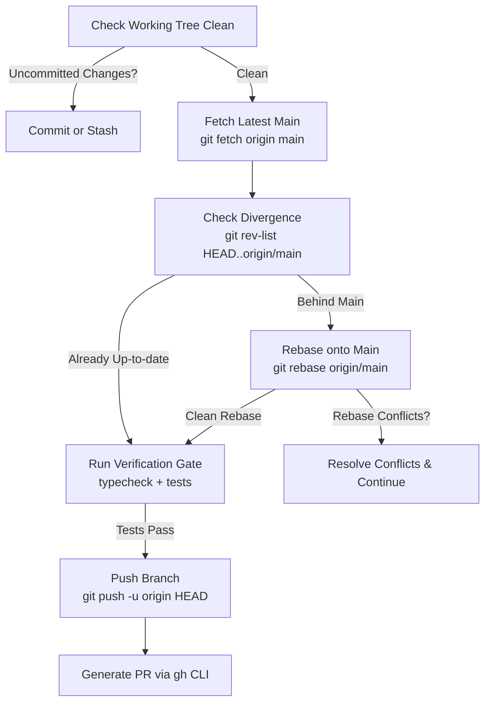

# PR Creator Skill

The **pr-creator** skill automates the creation of high-quality GitHub Pull Requests targeting the `main` branch. It guarantees that the branch is synchronized with the latest `main`, strictly validates branch naming conventions, generates standardized PR titles conforming to Conventional Commits + Jira keys, and renders a comprehensive, audit-ready PR description.

---

## 🛡️ Core Guarantees

1. **Always Latest `main`**: Fetches and rebases onto `origin/main` before opening the PR, ensuring zero stale branch divergence or unexpected merge conflicts.
2. **Consistent Branch Naming**: Enforces `<type>/<JIRA-KEY>-<kebab-case-slug>` naming standards.
3. **Standardized PR Titles**: Formats titles as `<type>(<scope>): [VS-<KEY>] <imperative description>` (max 72 chars).
4. **Audit-Ready PR Body**: Automatically populates Jira links, executive summaries, architectural changes, Vitest results, and VoteSphere Constitution compliance (§I–§VI).

---

## 🏷️ Branch Naming Specification

All branches must adhere strictly to the following structure:

```text
<type>/<JIRA-KEY>-<kebab-case-slug>
```

### Allowed Types
| Type | Usage | Example |
| :--- | :--- | :--- |
| `feature/` | New user-facing or platform features | `feature/VS-38-dynamic-category-integration` |
| `fix/` | Bug fixes or edge-case resolutions | `fix/VS-12-supabase-prisma-migration` |
| `refactor/` | Architectural or internal cleanup | `refactor/VS-20-voting-engine-transactions` |
| `test/` | Adding or refactoring test suites | `test/VS-44-s3-vitest-mock-suite` |
| `chore/` | Tooling, config, or dependency updates | `chore/VS-14-confluence-workflow-docs` |
| `docs/` | Documentation and architecture guides | `docs/VS-9-graphify-knowledge-graph` |

### Normalization Rules
1. Jira key must be **uppercase** (`VS-38`, not `vs-38`).
2. Slug must be **lowercase kebab-case** with alphanumeric characters and hyphens only.
3. Strip trailing hyphens and keep the slug concise (max 40 characters).

---

## 🔄 Latest `main` Synchronization Protocol

Before creating a PR, execute the synchronization sequence:



### Commands Sequence:
```bash
# 1. Ensure working directory is clean
git status -s

# 2. Fetch latest remote main
git fetch origin main

# 3. Rebase onto latest main
git rebase origin/main

# 4. Verify intermediate compilation & tests pass after rebase
npm run typecheck
npm run test

# 5. Push branch with force-with-lease (if rebased) and upstream tracking
git push -u origin HEAD --force-with-lease
```

---

## 📝 PR Title Specification

Titles must follow the Conventional Commits format combined with the bracketed Jira key:

```text
<type>(<scope>): [<JIRA-KEY>] <imperative summary>
```

### Constraints:
- **Maximum Length**: 72 characters.
- **Mood**: Imperative ("add", "integrate", "fix", NOT "added", "integrates").
- **Case**: Lowercase description, uppercase Jira key.
- **Punctuation**: No trailing period.

### Examples:
- `feat(categories): [VS-38] integrate dynamic categories into candidate form`
- `feat(voting): [VS-20] add atomic concurrency locks to voting engine`
- `feat(social): [VS-25] generate 9:16 post-vote story card with qr code`
- `fix(storage): [VS-42] handle presigned upload url expiration timeout`

---

## 📄 PR Description Template

Load the template from `.agents/skills/pr-creator/templates/pull-request-template.md` and substitute the tokens:

```markdown
## 📌 Jira Ticket
- **Issue**: [VS-38](https://the-three-devsketeers.atlassian.net/browse/VS-38)
- **Issue Type**: Story
- **Story Points**: 3 SP
- **Parent Epic**: VS-35 (Organizer Competition Categories & Award Tracks Management)

---

## 🎯 Executive Summary
Integrates active event divisions and award categories dynamically into the contestant registration modal (`ContestantFormModal`) and public event roster filter bar (`CategoryFilterBar`), replacing hardcoded categories with event-scoped taxonomy.

---

## 🧱 Key Architectural & Code Changes
- **Module / Feature Slice**: `src/features/contestants/`, `src/features/events/`
- **Key Changes**:
  - Connected `CategoryFilterBar` to active divisions fetched from event settings.
  - Updated `CandidateForm` division dropdown to dynamically populate from `event.divisions`.
  - Added responsive badge styling for category filter pills conforming to WCAG 2.2 contrast.

---

## 🧪 Testing & Verification Report
- [x] **Unit & Integration Tests**: `npm run test` (14 tests passing)
- [x] **TypeScript Strict Typecheck**: `npm run typecheck` (0 errors)
- [x] **ESLint Linting**: `npx eslint .` (0 warnings/errors)
- [x] **Environment Validation**: Verified zero raw `process.env` bypasses (§IV)

---

## 🏛️ VoteSphere Constitution Compliance Checklist
- [x] **§I: Feature-Sliced Architecture**: Code strictly encapsulated under `src/features/`.
- [x] **§II: Route Handler Security & Authorization**: Session verified via `getSession()` and payloads parsed via Zod.
- [x] **§III: Zero Regressions**: All test suites pass.
- [x] **§IV: Centralized Environment Variables**: All environment variables validated in `src/env.ts`.
- [x] **§V: WCAG 2.2 AA Accessibility**: Semantic HTML, accessible color contrast, and keyboard navigation.
- [x] **§VI: Atomic Conventional Commits**: All changes committed as single-purpose Conventional Commits.

---

## 📸 Visual Evidence / UI Preview
- Tested on desktop and mobile viewports. Category pills wrap cleanly without horizontal scroll overflow.
```

---

## 🚀 Execution Automation

### Option A: GitHub CLI (`gh`)
Execute PR creation directly from the command line:
```bash
gh pr create \
  --base main \
  --head "$(git branch --show-current)" \
  --title "feat(categories): [VS-38] integrate dynamic categories into candidate form" \
  --body-file ".specify/pr-body.md"
```

### Option B: Fallback (Manual URL)
If `gh` CLI is not authenticated:
1. Push branch: `git push -u origin <branch-name>`
2. Construct the GitHub compare link:
   ```text
   https://github.com/<owner>/<repo>/compare/main...<branch-name>?expand=1
   ```
3. Output the link and markdown body directly to the user for 1-click creation.
