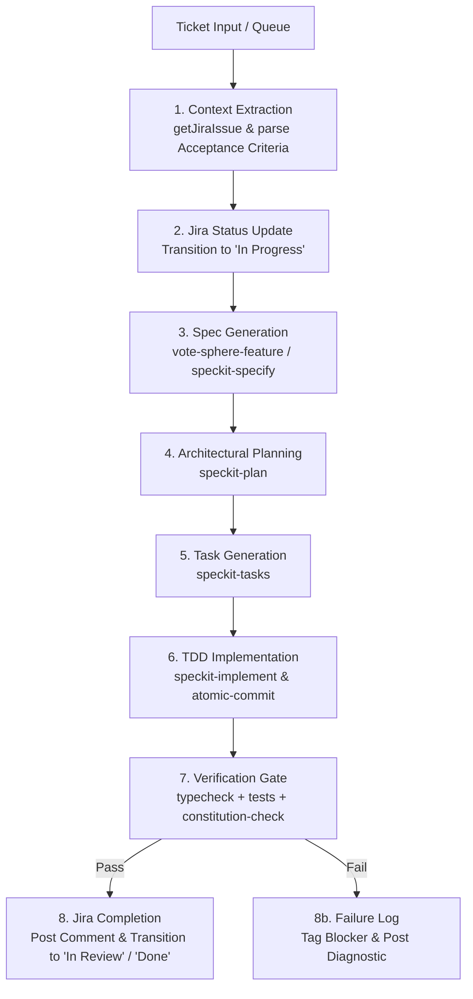

# SpecKit Multi-Implement Skill

The **speckit-multi-implement** skill batch-processes multiple Jira tickets or feature requests using the full Spec-Driven Development (SDD) lifecycle. For each ticket in the batch, it generates or adapts specifications, produces architectural plans, breaks down tasks, executes test-driven implementations, runs strict verification, and synchronizes progress back to Jira.

---

## 🎯 Core Capabilities

1. **Multi-Ticket Batch Ingestion**: Accepts a list of Jira keys (e.g. `VS-38, VS-25`), a structured `priority_queue.json`, or an epic key.
2. **End-to-End SpecKit Pipeline**: Drives each ticket through:
   `Jira AC Ingestion` ➔ `speckit-specify` ➔ `speckit-plan` ➔ `speckit-tasks` ➔ `speckit-implement` ➔ `Verification`.
3. **Automated Jira Ticket Lifecycle**:
   - Transitions ticket to **`In Progress`** upon kickoff.
   - Posts progress comments and implementation plans.
   - Transitions ticket to **`In Review`** or **`Done`** upon passing test suites.
4. **Resilient State Management**: Tracks per-ticket progress states (`QUEUED`, `SPECIFYING`, `PLANNING`, `IMPLEMENTING`, `VERIFYING`, `COMPLETED`, `BLOCKED`). If one ticket fails verification, subsequent uncoupled tickets can still proceed.
5. **Quality & Constitution Enforcement**: Automatically runs `constitution-check`, `env-validator`, and `atomic-commit` for every implemented story.

---

## 🔄 Execution Pipeline per Ticket



---

## 🛠️ Step-by-Step Implementation Guide

### Step 1: Ingest & Parse Ticket Scope
For each ticket key (e.g., `VS-38`):
1. Call `getJiraIssue` with `cloudId` and issue key.
2. Extract:
   - Summary and Issue Type (Story, Bug, Task).
   - Description and Gherkin Acceptance Criteria.
   - Target components, labels, and parent epic.

### Step 2: Transition Jira to `In Progress`
1. Transition ticket to `In Progress` via `transitionJiraIssue`.
2. Post an initial progress comment:
   ```markdown
   🤖 **SpecKit Automation Started**
   - **Branch**: `feature/<KEY>-<slug>`
   - **Pipeline**: Specification ➔ Architecture Plan ➔ Tasks ➔ TDD Implementation
   ```

### Step 3: Run SpecKit Lifecycle
1. **Feature Directory**:
   Check if feature slice exists under `src/features/<feature>/`. If not, bootstrap using `vote-sphere-feature <feature_name>`.
2. **Specification (`speckit-specify`)**:
   Populate `specs/<feature>/spec.md` with:
   - Mike Cohn user story (`As a... I want... So that...`).
   - Gherkin acceptance criteria matching the Jira ticket AC.
3. **Technical Plan (`speckit-plan`)**:
   Produce `specs/<feature>/plan.md` defining:
   - Data models & Prisma migrations (if applicable).
   - API route shells and Zod schemas under `src/lib/validations/` or `src/features/<feature>/types/`.
   - UI component hierarchy and hooks.
4. **Tasks (`speckit-tasks`)**:
   Generate `specs/<feature>/tasks.md` ordered by dependencies (Schema ➔ Services/API ➔ UI/Hooks ➔ Integration).

### Step 4: TDD Implementation (`speckit-implement`)
1. Implement in strict Red-Green-Refactor cycles:
   - Write failing unit/integration tests first (`vitest`).
   - Implement minimal working code to satisfy tests.
   - Refactor for performance, readability, and accessibility (WCAG 2.2 AA).
2. Follow **Atomic Commits**:
   - Stage and commit logical units separately (`feat(...)`, `test(...)`, `refactor(...)`).
   - Never create single "mega-commits".

### Step 5: Verification Gate
Run comprehensive project checks:
```bash
npm run typecheck
npm run test
npx eslint .
```
Verify that no `process.env` bypasses occur (VoteSphere Constitution §IV).

### Step 6: Post-Execution Jira Sync
1. Transition ticket to **`In Review`** (or **`Done`** if configured for auto-close).
2. Post a rich summary comment to the Jira ticket:
   ```markdown
   ✅ **SpecKit Implementation Complete**
   - **Pull Request / Branch**: `feature/<KEY>-<slug>`
   - **Files Modified**:
     - `src/features/...`
   - **Verification**:
     - Typecheck: PASSED (0 errors)
     - Unit Tests: PASSED (100% tests passing)
     - Constitution Compliance: §I–§VI Verified
   ```

---

## 📊 Batch Execution Tracker

When running multiple tickets, maintain a living batch report:

```markdown
### 📋 SpecKit Multi-Implement Execution Report

| Ticket | Title | Stream | Status | Tests | Commits | Jira Sync |
|:---:|:---|:---:|:---:|:---:|:---:|:---:|
| VS-38 | Dynamic Category Integration | Roster UI | ✅ COMPLETED | Passed | 3 commits | In Review |
| VS-20 | Core Voting Engine & Locks | Backend | 🔄 IN_PROGRESS | Running | 2 commits | In Progress |
| VS-25 | Viral Story Generator | UI | ⏳ QUEUED | — | — | To Do |
```

---

## 🛡️ Failure Isolation & Guardrails

- **Zero Cascading Failure**: If ticket `VS-A` fails verification or typechecking, stash or isolate its work on its own feature branch, report the diagnostic to Jira, and cleanly proceed to independent ticket `VS-B`.
- **Git Worktree Isolation for Parallel Runs**:
  - When batch-executing multiple tickets concurrently, execute each ticket inside an isolated git worktree:
    ```bash
    git worktree add .worktrees/VS-<KEY> -b feature/VS-<KEY>-<slug> origin/main
    ```
  - This prevents concurrent workers from clobbering each other's branch checkouts, dirty git staging areas, or build caches.
  - After PR creation, clean up via `git worktree remove .worktrees/VS-<KEY> --force`.
- **Preserve Clean Working Tree**: Never switch branches or start the next ticket with uncommitted changes in the working directory. Always verify `git status -s` is empty before starting the next ticket.
