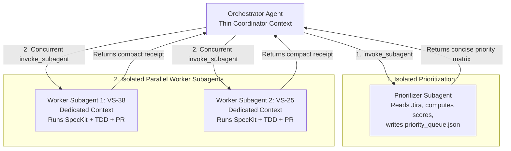

# SpecKit Sprint Orchestrator Skill

The **speckit-sprint-orchestrator** skill is the master conductor for autonomous sprint delivery. It unifies backlog prioritization, multi-ticket SpecKit development, and automated PR generation while strictly maintaining **Context Window Hygiene** through isolated subagents.

---

## 🧠 The Context Window Problem & Solution

### ❌ The Anti-Pattern (Monolithic Context Bleed)
When an agent prioritizes stories, reads dozens of Jira tickets, drafts specifications, generates AST trees, writes hundreds of lines of code, runs Vitest test outputs, and executes git commands all within a single conversation, the context window explodes (100k+ tokens). This degrades reasoning, triggers hallucinations, hits rate limits, and causes compiler drift.

### ✅ The Orchestrator Pattern (Strict Isolation Architecture)
The Orchestrator functions exclusively as a **lightweight coordinator**. It delegates heavy cognitive workloads to dedicated subagents, each running with a clean context:



---

## 🚀 Execution Workflow

### Step 1: Launch Prioritization Subagent
The Orchestrator invokes an isolated research/planning subagent to triage Jira without bringing bulky issue descriptions into the master context:

```json
{
  "Subagents": [
    {
      "TypeName": "research",
      "Role": "Jira Sprint Prioritizer",
      "Prompt": "Run story-prioritizer on SCRUM Sprint 2. Fetch active unresolved tickets, score them using the multi-factor prioritization model, and write the structured execution queue to .specify/sprint/priority_queue.json. Return ONLY a concise markdown table of the top 3-5 prioritized tickets with their assigned parallel groups."
    }
  ]
}
```

The subagent responds with only the compact priority table and the location of `priority_queue.json`.

---

### Step 2: Partition Tickets into Parallel Streams
The Orchestrator reads the priority queue and groups tickets by their `parallelGroup`:
- **Group A (Public / Presentation UI)**: `VS-38` (Category integration), `VS-25` (Social story generator).
- **Group B (Core Engine / Security)**: `VS-20` (Voting transactions), `VS-29` (Cloudflare Turnstile).
- **Group C (Storage & Infrastructure)**: `VS-42` (S3 storage service), `VS-43` (Upload API routes).

Tickets in different groups have **zero file conflicts** and can be implemented concurrently.

---

### Step 3: Dispatch Worker Subagents in Isolated Worktrees
The Orchestrator launches independent worker subagents for non-conflicting tickets concurrently. Crucially, each subagent is provisioned with **`"Workspace": "share"`** (or an explicit git worktree at `.worktrees/VS-<KEY>`) so they operate on independent branches without sharing or corrupting the working tree:

```json
{
  "Subagents": [
    {
      "TypeName": "self",
      "Role": "SpecKit Worker: VS-38",
      "Workspace": "share",
      "Prompt": "Implement ticket VS-38 in isolated worktree. 1) Checkout/create branch feature/VS-38-dynamic-category-integration from latest origin/main. 2) Run speckit-multi-implement for VS-38 delivering all 8 canonical SpecKit artifacts (spec.md, research.md, data-model.md, contracts/, checklists/requirements.md, plan.md, quickstart.md, tasks.md). 3) Enforce TDD, Constitution checks, and atomic commits. 4) Use pr-creator to rebase onto latest main and open a GitHub PR. 5) Return ONLY a structured completion receipt containing PR URL, test results, and commit summary."
    },
    {
      "TypeName": "self",
      "Role": "SpecKit Worker: VS-25",
      "Workspace": "share",
      "Prompt": "Implement ticket VS-25 in isolated worktree. 1) Checkout/create branch feature/VS-25-social-share-story-generator from latest origin/main. 2) Run speckit-multi-implement for VS-25 delivering all 8 canonical SpecKit artifacts (spec.md, research.md, data-model.md, contracts/, checklists/requirements.md, plan.md, quickstart.md, tasks.md). 3) Enforce TDD, Constitution checks, and atomic commits. 4) Use pr-creator to rebase onto latest main and open a GitHub PR. 5) Return ONLY a structured completion receipt containing PR URL, test results, and commit summary."
    }
  ]
}
```

#### 🌳 Native Git Worktree Lifecycle (Automated within Worker):
If running without subagent workspace sharing or via terminal/CLI scripts, each worker creates and cleans up a dedicated git worktree:
```bash
# 1. Fetch latest remote main
git fetch origin main

# 2. Spawn isolated worktree for this story
git worktree add .worktrees/VS-38 -b feature/VS-38-dynamic-category-integration origin/main

# 3. Execute implementation & testing inside worktree
cd .worktrees/VS-38
# ... SpecKit lifecycle, TDD, atomic commits, pr-creator ...

# 4. Clean up worktree after PR creation
cd ../..
git worktree remove .worktrees/VS-38 --force
```

---

### Step 4: Reactive Wakeup & Receipt Aggregation
The Orchestrator stops calling tools and relies on reactive wakeup. When each worker subagent completes, it delivers a **Compact Execution Receipt**:

```markdown
### 🏁 Execution Receipt: VS-38
- **Ticket**: [VS-38](https://the-three-devsketeers.atlassian.net/browse/VS-38)
- **Branch**: `feature/VS-38-dynamic-category-integration`
- **Pull Request**: [#45](https://github.com/the-three-devsketeers/vote-sphere/pull/45)
- **Status**: PASSED
- **Tests**: 12/12 passing (100% coverage)
- **Typecheck**: 0 errors
- **Constitution**: §I–§VI Verified
- **Commits**:
  - `feat(categories): add dynamic division dropdown to candidate form`
  - `feat(roster): render dynamic category filter pills on public event page`
  - `test(categories): add unit & integration tests for dynamic filters`
```

---

### Step 5: Final Sprint Master Report
After all worker subagents report back, the Orchestrator compiles the final summary report for the user:

```markdown
# 🏆 Sprint Orchestration Summary Report

| Jira Key | Feature | Status | Branch | PR Link | Verification |
|:---:|:---|:---:|:---|:---:|:---:|
| **VS-38** | Dynamic Category Integration | ✅ Merged/Ready | `feature/VS-38-dynamic-category` | [PR #45](#) | 12/12 Tests Pass |
| **VS-25** | Social Story Generator | ✅ Merged/Ready | `feature/VS-25-social-share` | [PR #46](#) | 8/8 Tests Pass |
| **VS-20** | Core Voting Engine | 🔄 Queued Next | `feature/VS-20-voting-engine` | — | Dependencies Cleared |
```

---

## 🛡️ Context Hygiene Principles

1. **Subagents Never Share Scratchpads**: Each worker subagent has an independent context. Massive terminal outputs, test traces, and ESLint warnings are contained within the worker and do not spill into the Orchestrator.
2. **Compact Contracts**: Communication between Orchestrator and Workers is limited to:
   - **Input**: Ticket Key, Title, AC Summary, Target Branch.
   - **Output**: Execution Receipt (PR URL, Test Results, Commit Hashes).
3. **Workspace Discipline**: Each worker operates on its designated feature branch to avoid dirty git trees.
