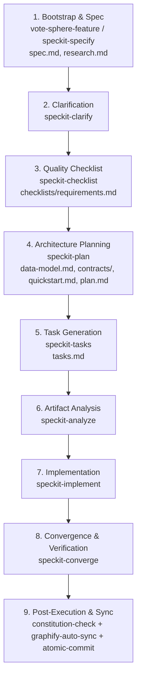

# SpecKit End-to-End Workflow Orchestrator

This skill orchestrates the entire Spec-Driven Development (SDD) lifecycle for Electa, systematically progressing through requirements, architecture, tasks, and test-driven implementation while honoring project constitutional constraints, complete 8-artifact spec delivery, and atomic commits.

---

## Workflow Phases & Complete 8-Artifact Deliverable Matrix

---

## 📁 The 8 Canonical SpecKit Artifacts (Mandatory Gate)

Every feature in `specs/<feature>/` MUST produce all 8 artifacts:

1. `spec.md` — User stories, Gherkin acceptance criteria, invariants
2. `research.md` — Stack constraints, technology decisions, rationale
3. `data-model.md` — Entity models, DTOs, storage schemas, state machines
4. `contracts/` — Component and API route validation contracts (Zod)
5. `checklists/requirements.md` — Requirements quality validation ("Unit tests for English")
6. `plan.md` — Technical implementation plan and boundary mapping
7. `quickstart.md` — Verification run guide, walkthrough scenarios
8. `tasks.md` — Actionable implementation tasks ordered by dependency

---

## Phase-by-Phase Execution Guide

### Phase 1: Bootstrap & Specification
1. Run `vote-sphere-feature <feature_name>` to create the full feature slice (`src/features/<feature>`, test directories, and spec directory).
2. Populate `specs/<feature>/spec.md` and `specs/<feature>/research.md`.

### Phase 2: Targeted Clarification
1. Invoke `speckit-clarify` to inspect `spec.md` for ambiguities and edge cases.
2. Resolve defaults or prompt user, updating `spec.md`.

### Phase 3: Requirements Quality Checklist
1. Invoke `speckit-checklist` to create `specs/<feature>/checklists/requirements.md`.
2. Ensure completeness, clarity, zero-radius Electa branding, and accessibility (WCAG 2.1 AA) criteria are covered.

### Phase 4: Architecture & Technical Planning
1. Produce `specs/<feature>/data-model.md` (Entities, DTOs, storage structures).
2. Produce `specs/<feature>/contracts/` (Typed interfaces, Zod schemas).
3. Produce `specs/<feature>/quickstart.md` (Reproduction steps, validation scenarios).
4. Produce `specs/<feature>/plan.md` (Boundary mapping, test plan).

### Phase 5: Task Generation
1. Invoke `speckit-tasks` to generate `specs/<feature>/tasks.md` with dependency-ordered phases.

### Phase 6: Cross-Artifact Analysis
1. Invoke `speckit-analyze` to confirm zero missing files or unscheduled dependencies before writing code.

### Phase 7: Test-Driven Implementation
1. Invoke `speckit-implement` to execute tasks in `tasks.md` (Red-Green-Refactor).
2. Update Jira ticket status to `In Progress` / `Done` if Jira MCP is active.
3. Adhere to the Atomic Commit rule.

### Phase 8: Convergence & Verification
1. Run `npm run typecheck`, `npm run lint`, and `npm run test:unit`.
2. Run `constitution-check` and `graphify-auto-sync`.
