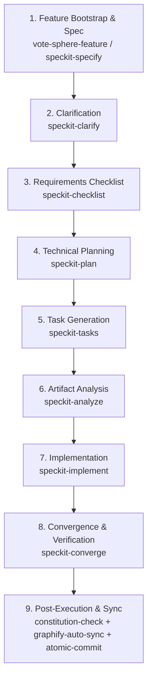

# SpecKit End-to-End Workflow Orchestrator

This skill orchestrates the entire Spec-Driven Development (SDD) lifecycle for VoteSphere, systematically progressing through requirements, architecture, tasks, and test-driven implementation while honoring project constitutional constraints and atomic commits.

---

## Workflow Phases & Execution Matrix

---

## Execution Modes

1. **Interactive Mode (Default)**:
   - Pauses at critical milestones (after Spec, Plan, and Task generation) for user sign-off.
   - Recommended for complex architecture or novel feature designs.

2. **Autonomous / Fast-Forward Mode (`--auto` or `--all`)**:
   - Executes all phases consecutively without pausing unless blockers or high-risk ambiguities are detected.

---

## Phase-by-Phase Execution Guide

### Phase 1: Bootstrap & Specification
1. Run `vote-sphere-feature <feature_name>` to create the feature directory shell (`src/features/<feature>`, test directories, and spec directory).
2. Invoke `speckit-specify` with the user's requirements to generate `.specify/specs/<feature>/spec.md` with:
   - User stories in Mike Cohn format (`As a... I want... So that...`)
   - Gherkin acceptance criteria (`Given... When... Then...`)
   - Non-functional requirements and data invariants.

### Phase 2: Targeted Clarification
1. Invoke `speckit-clarify` to inspect `spec.md` for ambiguities, edge cases, and edge constraints.
2. If ambiguities exist, prompt the user with targeted questions or resolve defaults based on VoteSphere Constitution principles (§I–§VI).
3. Update `spec.md` with the finalized clarifications.

### Phase 3: Requirements & Readiness Checklist
1. Invoke `speckit-checklist` to create or evaluate domain-specific checklists under `.specify/specs/<feature>/checklists/`.
2. Ensure accessibility, security (VoteSphere Constitution §II), and test coverage requirements are captured.

### Phase 4: Architecture & Technical Planning
1. Invoke `speckit-plan` to produce `.specify/specs/<feature>/plan.md`:
   - Feature boundary mapping (`src/features/<feature>/`)
   - Schema / migration requirements (`prisma/schema.prisma`)
   - API route shells & Zod contracts
   - Component & state management structure
   - **Branding & Theme Check**: Enforce Light Mode default (Opal `#F8FAFC`), strict zero-radius (`rounded-none`), and brand typography (Outfit/Sora).

### Phase 5: Task Generation
1. Invoke `speckit-tasks` to generate `.specify/specs/<feature>/tasks.md`:
   - Group tasks by dependency phase (Schema ➔ Services/API ➔ UI/Hooks ➔ Integration).
   - Tag tasks with Jira issue keys if integrated.

### Phase 6: Cross-Artifact Analysis
1. Invoke `speckit-analyze` to verify consistency across `spec.md`, `plan.md`, and `tasks.md`.
2. Confirm zero dangling requirements or unscheduled dependencies before touching code.

### Phase 7: Test-Driven Implementation
1. Invoke `speckit-implement` to execute tasks in `tasks.md`:
   - Strictly follow Red-Green-Refactor (TDD).
   - Enforce VoteSphere branding: Light Mode default, `.btn-primary`, `.card-style`, zero-radius, and scoped `dark:` variants.
   - Update Jira issue statuses (In Progress / Resolved) if Jira MCP is active.
   - Adhere to the Atomic Commit rule (stage and commit logical units individually).

### Phase 8: Convergence & Gap Detection
1. Invoke `speckit-converge` to inspect active code against `spec.md` and `plan.md`.
2. Append any missed edge cases or incomplete stories to `tasks.md` and complete them.

### Phase 9: Quality Gate & Knowledge Graph Sync
1. Run `constitution-check` to ensure no constitutional violations (§I–§VI) or brand violations (§VII).
2. Run `env-validator` to ensure no raw `process.env` leaks.
3. Run `graphify-auto-sync` (`graphify . --update`) to update AST knowledge graphs.
4. Perform atomic commits with conventional commit messages.

