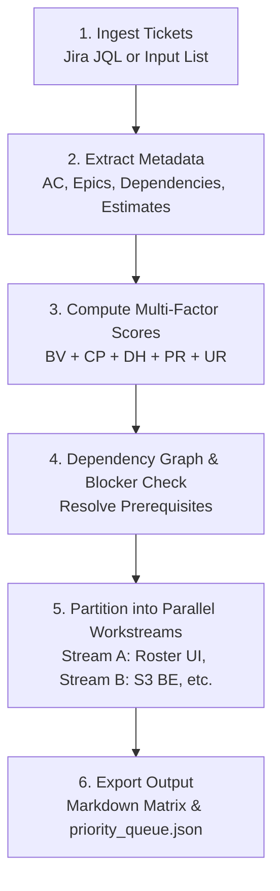

# Story Prioritizer Skill

The **story-prioritizer** skill audits Jira boards, sprints, and backlogs to compute an objective, multi-factor priority score for user stories. It structures stories into an actionable execution queue, maps technical dependencies, and identifies **parallel work streams** that can be executed concurrently by multiple developers or subagents without merge conflicts.

---

## 🎯 Core Objectives

1. **Maximize Business Value & Monetization**: Fast-track P0 revenue generators and core transaction flows.
2. **Close Incomplete Epics**: Prioritize dangling stories in epics that are already >70% complete to convert sunk engineering cost into shippable user value.
3. **Enforce Dependency Hygiene**: Ensure foundational database schemas, API contracts, and auth services are scheduled before downstream UI consumers.
4. **Identify Parallel Tracks**: Group decoupled, collision-free tickets (e.g., isolated UI components vs. backend service modules) for concurrent execution.
5. **Context Efficiency**: Produce a clean, structured output (`priority_queue.json`) that can be consumed by downstream orchestrators without bloating LLM context.

---

## 📐 Multi-Factor Prioritization Scoring Model

Each ticket is evaluated against 5 weighted dimensions on a 0–100 scale:

$$\text{Score} = (0.30 \times \text{BV}) + (0.25 \times \text{CP}) + (0.20 \times \text{DH}) + (0.15 \times \text{PR}) + (0.10 \times \text{UR})$$

| Factor | Weight | Evaluation Criteria |
| :--- | :---: | :--- |
| **Business Value (BV)** | 30% | Platform monetization (paid boosts, QR Ph rails), core voting transactions, organizer conversion. |
| **Critical Path & Epic Completion (CP)** | 25% | Stories completing an existing epic (e.g. `VS-38` closing `VS-35`) or unblocking entire future phases. |
| **Dependency Hygiene (DH)** | 20% | High score if all prerequisites are fulfilled; zero/penalized if blocked by unstarted upstream tickets. |
| **Parallel Readiness (PR)** | 15% | High score if the ticket operates in an isolated route/directory (e.g., self-contained Canvas modal or independent display route). |
| **Urgency & Risk (UR)** | 10% | Security vulnerabilities, bot mitigation (Cloudflare Turnstile), fraud deterrence, or sprint deadline proximity. |

---

## 🔄 Prioritization Workflow



### Step 1: Ingest Tickets
Query Jira using JQL for unresolved tickets in the active sprint or target epic:
```jql
project = VS AND sprint in openSprints() AND resolution = Unresolved ORDER BY Rank ASC
```
If specific ticket keys are provided as arguments (e.g. `VS-38, VS-20, VS-21`), fetch each ticket using `getJiraIssue`.

### Step 2: Analyze Technical Boundaries
Inspect which files, layers, and modules the story touches:
- **UI Only**: Components under `src/features/<feature>/components/` (Low conflict risk).
- **Backend / API**: Route handlers under `src/app/api/` or services in `src/lib/`.
- **Database / Schema**: `prisma/schema.prisma` (High conflict risk; must be serialized or sequenced first).
- **Standalone Routes**: Isolated pages like `/events/[slug]/stage-display` or modals.

### Step 3: Identify Parallel Tracks
Group tickets into **Collision-Free Parallel Groups**:
- **Group A (Public / Presentation UI)**: Independent client components (e.g., `VS-38`, `VS-25`, `VS-27`).
- **Group B (Backend Storage / Media)**: Independent infrastructure libraries (e.g., `VS-42`, `VS-43`).
- **Group C (Transactional Engine)**: Core transactional database workflows (e.g., `VS-20`, `VS-29`).
- **Group D (Monetization & Gateways)**: Payment webhooks and dynamic QR generation (e.g., `VS-21`).

---

## 📄 Standardized Output Schema

The skill must output both a human-readable Markdown table and a machine-parsable JSON artifact:

### 1. Human-Readable Matrix
```markdown
### 🎯 Sprint Execution Queue

| Rank | Key | Summary | Stream | Est | Blocker / Prereq | Parallel Group |
|:---:|:---|:---|:---|:---:|:---|:---:|
| 1 | VS-38 | Dynamic Category Integration | UI | 3 SP | None (VS-36 Done) | Group A |
| 2 | VS-20 | Core Voting Engine & Locks | Backend | 8 SP | None (VS-28 Done) | Group C |
| 3 | VS-29 | Cloudflare Turnstile Bot Guard | Security | 3 SP | Pair with VS-20 | Group C |
| 4 | VS-25 | Viral Social Story Generator | UI | 3 SP | None | Group A |
```

### 2. Machine-Readable `priority_queue.json`
When executed by an orchestrator, write this compact JSON artifact to disk or pass it as output:
```json
{
  "timestamp": "2026-10-01T00:50:00Z",
  "sprint": "SCRUM Sprint 2",
  "queue": [
    {
      "rank": 1,
      "key": "VS-38",
      "title": "Dynamic Category Integration in Contestant Form & Public Roster Filter Bar",
      "type": "Story",
      "priority": "High",
      "points": 3,
      "stream": "frontend-roster",
      "parallelGroup": "GROUP_A",
      "branchName": "feature/VS-38-dynamic-category-integration",
      "prerequisites": [],
      "targetDirectories": [
        "src/features/contestants/components/",
        "src/features/events/components/"
      ]
    },
    {
      "rank": 2,
      "key": "VS-20",
      "title": "Core Voting Engine, Omnichannel Auth & Anti-Fraud",
      "type": "Story",
      "priority": "Highest",
      "points": 8,
      "stream": "voting-engine",
      "parallelGroup": "GROUP_C",
      "branchName": "feature/VS-20-core-voting-engine",
      "prerequisites": ["VS-28"],
      "targetDirectories": [
        "src/features/voting/actions/",
        "src/app/api/events/[slug]/vote/"
      ]
    }
  ]
}
```

---

## 🛡️ Guardrails

- **Never prioritize blocked work**: If a ticket depends on an unstarted backend schema migration, flag it as `BLOCKED` and defer it until the dependency is resolved.
- **Limit WIP per parallel stream**: Never recommend more than 1 ticket per developer or subagent within the same directory boundary.
- **Preserve Jira integrity**: Read-only analysis — do not modify ticket statuses during prioritization. Status updates belong in implementation workflows.
