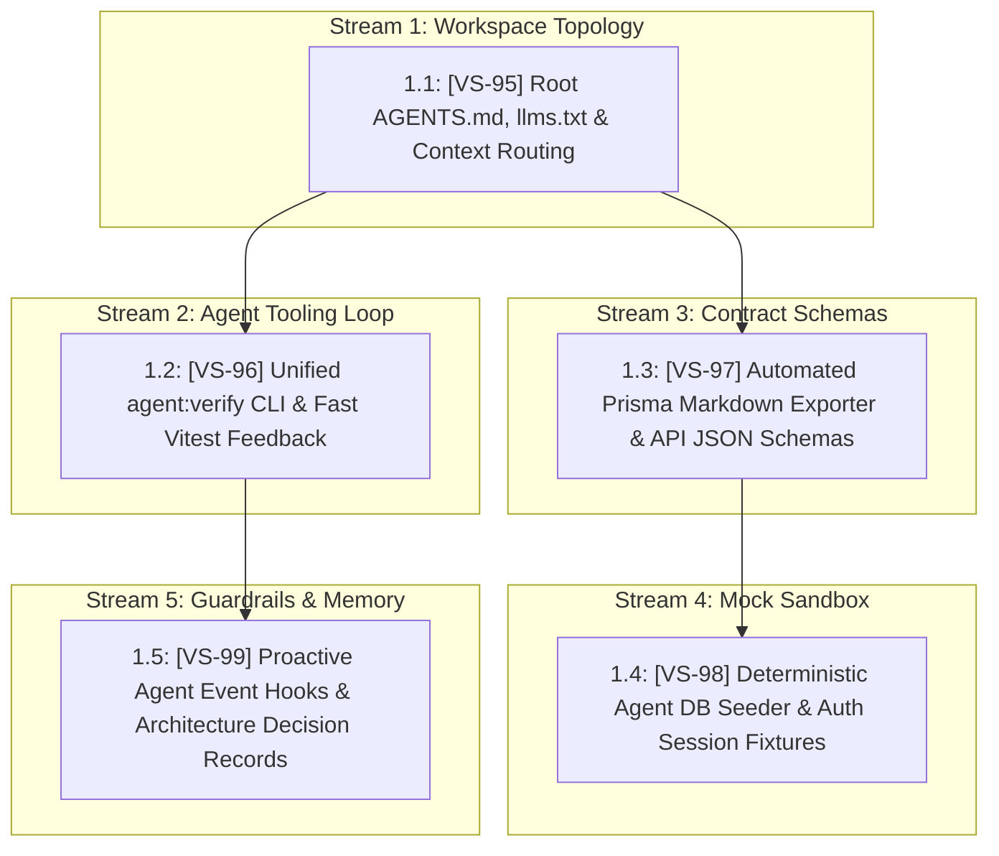

# [EPIC-VS-94] AI-Native Repository Architecture & Autonomous Agent Enablement

> **Jira Epic**: [**VS-94: [Epic] AI-Native Repository Architecture & Autonomous Agent Enablement**](https://the-three-devsketeers.atlassian.net/browse/VS-94)  
> **Status**: Ready for Backlog Grooming / Implementation  
> **Target Release**: Platform Tooling & Agent Reliability Milestone  
> **Scope**: `electa-workspace` (Unified `electa-fullstack` & `electa-infra`)

---

## 🎯 1. Executive Summary & Objective

Transform the Electa mono-workspace (`electa-workspace`, encompassing `electa-fullstack` and `electa-infra`) into an enterprise-grade, **AI-Native Engineering Environment**.

While Electa currently maintains foundational agent rules and SpecKit workflows, scaling multi-agent autonomy (planning, autonomous implementation, TDD loops, and CI verification) requires machine-readable contracts, unified root-level repository topologies, one-shot agent feedback verification commands, deterministic sandboxes/mocks, and proactive guardrails.

---

## 💼 2. Business Value & Success Metrics (KPIs)

```
┌─────────────────────────────────────────────────────────────────────────────┐
│                            SUCCESS METRICS & KPIS                           │
│  • Agent Onboarding Time: 0 human explanations needed for new agent sessions│
│  • Single-Command Verification: `npm run agent:verify` passes in < 15s      │
│  • Schema Ingestion Overhead: Reduced by > 80% via condensed Markdown ERDs  │
│  • Headless Agent Test Autonomy: 100% mocked local DB/auth fixture isolation│
│  • Zero Constitutional Drift: PreToolUse/PostToolUse hooks block regressions │
└─────────────────────────────────────────────────────────────────────────────┘
```

---

## 🧱 3. Five Core Pillars of AI-Native Engineering

### Pillar 1: Root Workspace Topology & Context Routing

- Root `AGENTS.md` and `llms.txt` defining sibling repository boundaries (`electa-fullstack` vs `electa-infra`).
- Clear routing heuristics directing agents to the correct working directory and domain conventions.

### Pillar 2: One-Shot Agent Tooling Loop

- Unified `npm run agent:verify` command executing typecheck, linting, unit tests, and environment checks in a single exit-coded process.
- Fast incremental test execution (`vitest related --run`) to enable sub-second agent TDD loops.

### Pillar 3: Machine-Readable Contracts & Schema Summaries

- Automated export of `prisma/schema.prisma` into condensed Markdown tables and Mermaid ERDs.
- Machine-readable Zod-derived JSON/OpenAPI schemas for Next.js App Router Route Handlers (`src/app/api/**`).

### Pillar 4: Deterministic Sandboxes & Mock Environments

- Deterministic mock database seed script (`npm run db:seed:agent`) providing pre-populated users, pageants, and transactions.
- Zero-auth fixture session mocks for headless agent component and route validation without live cloud credentials.

### Pillar 5: Architectural Memory & Proactive Guardrails

- Structured Architecture Decision Records (`docs/adr/`) linked into knowledge graphs (`graphify`).
- Enhanced event hooks (`hooks.json`) enforcing constitutional principles, contrast verification, and git hygiene.

---

## 🗺️ 4. Execution Order & Dependency Graph



---

## 📋 5. Jira User Stories Breakdown

| Order   | Jira Key                                                              | Story Summary                                                                       | Priority | Core Focus                                                                          | Dependencies                           |
| ------- | --------------------------------------------------------------------- | ----------------------------------------------------------------------------------- | -------- | ----------------------------------------------------------------------------------- | -------------------------------------- |
| **1.1** | [**VS-95**](https://the-three-devsketeers.atlassian.net/browse/VS-95) | `BE: 1.1 Root Workspace Topology, AGENTS.md Navigation Index & llms.txt Routing`    | High     | Unifies sibling repo boundaries, agent roles, and entry points                      | _None (Foundation)_                    |
| **1.2** | [**VS-96**](https://the-three-devsketeers.atlassian.net/browse/VS-96) | `BE: 1.2 Unified Agent Verification CLI (agent:verify) & Fast Vitest Feedback Loop` | High     | Single-command validation (`typecheck + lint + unit + env`) & changed-file testing  | Blocked by `VS-95`                     |
| **1.3** | [**VS-97**](https://the-three-devsketeers.atlassian.net/browse/VS-97) | `BE: 1.3 Automated Prisma Markdown Exporter & API Route JSON Schemas`               | Medium   | Token-efficient data models and machine-readable Route Handler contracts            | Blocked by `VS-95`                     |
| **1.4** | [**VS-98**](https://the-three-devsketeers.atlassian.net/browse/VS-98) | `BE: 1.4 Headless Agent Mock DB Seeder & Zero-Auth Cognito Session Fixtures`        | Medium   | Headless, zero-auth local database testing for autonomous runs                      | Blocked by `VS-97`, Relates to `VS-55` |
| **1.5** | [**VS-99**](https://the-three-devsketeers.atlassian.net/browse/VS-99) | `BE: 1.5 Proactive Agent Event Hooks & Architecture Decision Records (ADRs)`        | Medium   | Pre/Post-tool hooks, WCAG contrast verification, and permanent architectural memory | Blocked by `VS-96`                     |

---

## 🏁 6. Definition of Done (DoD)

- [x] Jira Epic [VS-94](https://the-three-devsketeers.atlassian.net/browse/VS-94) created and linked to stories VS-95 through VS-99.
- [ ] Root `AGENTS.md` and `llms.txt` active at `electa-workspace/`.
- [ ] `npm run agent:verify` available and green in CI/local runs.
- [ ] Database schema summary generated automatically upon migration.
- [ ] Seed script allows any subagent to test full voting flows headlessly.
- [ ] Architectural Decision Records initialized in `docs/adr/`.
