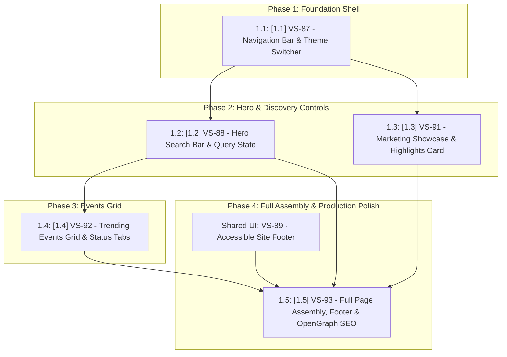

# [EPIC-VS-90] Electa Public Landing Page & Event Discovery Portal

> **Jira Epic**: [**VS-90: Electa Public Landing Page & Event Discovery Portal**](https://the-three-devsketeers.atlassian.net/browse/VS-90)  
> **Status**: Ready for Backlog Grooming / Implementation  
> **Target Release**: MVP Public Launch  
> **Source Mockup**: [`public/mockup-realistic.html`](file:///c:/Users/Roselle%20Tabuena/workspace/electa-workspace/electa-fullstack/public/mockup-realistic.html)  
> **Design Philosophy**: Brutalist-Refined Zero-Radius (`--radius: 0px`), Light-Mode Opal Default (`#F8FAFC`), Obsidian Dark Mode (`#090D16`), WCAG 2.1 AA

---

## 🎯 1. Executive Summary & Objective

Build the official public **Homepage** for Electa based on the finalized `mockup-realistic.html`.

The landing page serves as the single, unified public entry point for anyone visiting `electa.ph`:

- **Brand & Platform Overview**: Introduces Electa as the modern digital voting platform for live competitions, highlighting its core advantages (anti-abuse protection, live stage leaderboards, Philippine e-wallets, and fast event setup).
- **Public Event Discovery**: Allows visitors to search and explore active, upcoming, or concluded competitions.
- **Direct Entry Points**: Provides immediate access to create an event via `+ CREATE EVENT` or sign in to an account via `SIGN IN`.

_(Note: Most active voters will access events directly via specific shared event links like `/events/[slug]`. The root landing page represents the public face and discovery hub of the platform.)_

---

## 💼 2. Business Value & Success Metrics (KPIs)

```
┌─────────────────────────────────────────────────────────────────────────────┐
│                            SUCCESS METRICS & KPIS                           │
│  • Instant First Contentful Paint (FCP < 0.8s) & LCP < 1.2s                 │
│  • Zero Cumulative Layout Shift (CLS < 0.02) across all screen sizes         │
│  • Direct access to Event Creation (`/events/new`) and Auth (`/login`)      │
│  • 100% Theme Parity (Opal Light default + Obsidian Dark mode)              │
│  • Strict WCAG 2.1 AA compliance across all text and interactive controls   │
└─────────────────────────────────────────────────────────────────────────────┘
```

---

## 🧱 3. Architecture & Visual Design Contract

- **Geometry**: Strict zero-radius (`--radius: 0px`, `rounded-none`). No rounded corners on buttons, cards, search inputs, or badges.
- **Color System**:
  - Light Mode Default: Opal Slate-50 background (`#F8FAFC`), crisp white surfaces (`#FFFFFF`), Slate-900 typography (`#0F172A`), Sky Blue accent (`#0369A1` / `#0284C7`).
  - Dark Mode: Obsidian background (`#090D16`), deep navy surfaces (`#0D1424`), Sky Blue accent (`#38BDF8`).
- **Typography**:
  - Headings: `Outfit` (Bold, uppercase, geometric).
  - Body & UI: `Sora` (High legibility).
  - Metrics & Timers: `JetBrains Mono` (Tabular alignment).
- **Framework Architecture**: Next.js 16 App Router Server Component (`src/app/page.tsx`) with isolated Client islands for search, status filtering, and theme switching.

---

## 🗺️ 4. Execution Order & Dependency Graph



---

## 📋 5. Ordered User Stories & Dependency Matrix

|   Order   |                               Jira Key                                | Story Summary / Title                                                                      | Points | Preceding Dependencies                                                                                         | Downstream Blockers        |
| :-------: | :-------------------------------------------------------------------: | :----------------------------------------------------------------------------------------- | :----: | :------------------------------------------------------------------------------------------------------------- | :------------------------- |
| **`1.1`** | [**VS-87**](https://the-three-devsketeers.atlassian.net/browse/VS-87) | **[1.1] Responsive Site Navigation Bar with Electa Brand Mark & Theme Switcher**           |   3    | _None (Foundational Shell)_                                                                                    | Blocks `1.2`, `1.3`, `1.5` |
| **`1.2`** | [**VS-88**](https://the-three-devsketeers.atlassian.net/browse/VS-88) | **[1.2] Global Event & Candidate Search Bar with Instant Filtering & Keyboard Navigation** |   5    | Requires `1.1` (VS-87)                                                                                         | Blocks `1.3`, `1.4`, `1.5` |
| **`1.3`** | [**VS-91**](https://the-three-devsketeers.atlassian.net/browse/VS-91) | **[1.3] [Landing Page] Hero Marketing Value Showcase & Platform Highlights Card**          |   5    | Requires `1.1` (VS-87) & `1.2` (VS-88)                                                                         | Blocks `1.5`               |
| **`1.4`** | [**VS-92**](https://the-three-devsketeers.atlassian.net/browse/VS-92) | **[1.4] [Landing Page] Trending Events Grid & Lifecycle Status Filters**                   |   5    | Requires `1.2` (VS-88 for search query sync)                                                                   | Blocks `1.5`               |
| **`1.5`** | [**VS-93**](https://the-three-devsketeers.atlassian.net/browse/VS-93) | **[1.5] [Landing Page] Full Page Assembly, Accessible Footer & OpenGraph SEO**             |   3    | Requires `1.1`, `1.2`, `1.3`, `1.4`, and [**VS-89**](https://the-three-devsketeers.atlassian.net/browse/VS-89) | _Final Release_            |

---

### 🎟️ [1.1] Responsive Site Navigation Bar with Electa Brand Mark & Theme Switcher

- **Jira Issue**: [**VS-87**](https://the-three-devsketeers.atlassian.net/browse/VS-87)
- **Priority**: High (P1)
- **Story Points**: 3
- **Execution Order**: **`1.1` (Step 1)**
- **Preceding Dependencies**: None _(Foundational global shell)_
- **Downstream Blockers**: `1.2` ([VS-88](https://the-three-devsketeers.atlassian.net/browse/VS-88)), `1.3` ([VS-91](https://the-three-devsketeers.atlassian.net/browse/VS-91)), `1.5` ([VS-93](https://the-three-devsketeers.atlassian.net/browse/VS-93))
- **Linked Work Items in Jira**: Relates to [VS-90](https://the-three-devsketeers.atlassian.net/browse/VS-90), Blocks [VS-88](https://the-three-devsketeers.atlassian.net/browse/VS-88)

- **Story Description**:  
  **As a** public visitor,  
  **I want** a persistent, responsive header with the Electa brand mark, theme toggle, and quick-action navigation (`+ CREATE EVENT`, `SIGN IN`),  
  **so that** I can easily navigate the platform, toggle between light and dark mode, or access key actions from any device.

- **Acceptance Criteria (Gherkin)**:
  - **Scenario**: Brand and Navigation Rendering
    - **Given** a user loads the Electa landing page,
    - **When** the viewport is desktop (≥ 1024px) or mobile (< 600px),
    - **Then** the Electa logo (`electa-logo.svg`), wordmark, and tagline _"VOTE · ENGAGE · CELEBRATE"_ must render with zero radius,
    - **And** the `+ CREATE EVENT` and `SIGN IN` action buttons must be visible and properly styled.
  - **Scenario**: Theme Toggling
    - **Given** the site defaults to Opal Light Mode,
    - **When** the user clicks the theme toggle button,
    - **Then** the page must instantly switch to Obsidian Dark Mode without layout flash,
    - **And** the preference must persist in `localStorage` under `electa-theme`.

---

### 🎟️ [1.2] Global Event & Candidate Search Bar with Instant Filtering & Keyboard Navigation

- **Jira Issue**: [**VS-88**](https://the-three-devsketeers.atlassian.net/browse/VS-88)
- **Priority**: High (P1)
- **Story Points**: 5
- **Execution Order**: **`1.2` (Step 2)**
- **Preceding Dependencies**: `1.1` ([VS-87](https://the-three-devsketeers.atlassian.net/browse/VS-87))
- **Downstream Blockers**: `1.3` ([VS-91](https://the-three-devsketeers.atlassian.net/browse/VS-91)), `1.4` ([VS-92](https://the-three-devsketeers.atlassian.net/browse/VS-92)), `1.5` ([VS-93](https://the-three-devsketeers.atlassian.net/browse/VS-93))
- **Linked Work Items in Jira**: Relates to [VS-90](https://the-three-devsketeers.atlassian.net/browse/VS-90), Blocked by [VS-87](https://the-three-devsketeers.atlassian.net/browse/VS-87), Blocks [VS-91](https://the-three-devsketeers.atlassian.net/browse/VS-91) & [VS-92](https://the-three-devsketeers.atlassian.net/browse/VS-92)

- **Story Description**:  
  **As a** public visitor,  
  **I want** an instant search box in the hero section to look up events by title, location, or candidate name,  
  **so that** I can immediately locate specific competitions without manual browsing.

- **Acceptance Criteria (Gherkin)**:
  - **Scenario**: Real-Time Event Search
    - **Given** a visitor is on the landing page,
    - **When** the visitor enters text (e.g., _"Luzon"_ or _"Binangonan"_) into the search field,
    - **Then** the events grid below must filter dynamically in real time matching the event title, province/region, or contestant rosters,
    - **And** pressing `Enter` or clicking `SEARCH` must smoothly scroll the viewport down to the filtered results.
  - **Scenario**: Empty Query Reset
    - **Given** a filtered view,
    - **When** the visitor clears the search input,
    - **Then** the full active event collection must restore immediately.

---

### 🎟️ [1.3] [Landing Page] Hero Marketing Value Showcase & Platform Highlights Card

- **Jira Issue**: [**VS-91**](https://the-three-devsketeers.atlassian.net/browse/VS-91)
- **Priority**: High (P1)
- **Story Points**: 5
- **Execution Order**: **`1.3` (Step 3)**
- **Preceding Dependencies**: `1.1` ([VS-87](https://the-three-devsketeers.atlassian.net/browse/VS-87)) and `1.2` ([VS-88](https://the-three-devsketeers.atlassian.net/browse/VS-88))
- **Downstream Blockers**: `1.5` ([VS-93](https://the-three-devsketeers.atlassian.net/browse/VS-93))
- **Linked Work Items in Jira**: Relates to [VS-90](https://the-three-devsketeers.atlassian.net/browse/VS-90), Blocked by [VS-87](https://the-three-devsketeers.atlassian.net/browse/VS-87) & [VS-88](https://the-three-devsketeers.atlassian.net/browse/VS-88), Blocks [VS-93](https://the-three-devsketeers.atlassian.net/browse/VS-93)

- **Story Description**:  
  **As a** public visitor,  
  **I want** to see an authentic marketing panel showcasing Electa's core platform capabilities and trust factors,  
  **so that** I understand how the platform works and why it is trusted for live event voting.

- **Acceptance Criteria (Gherkin)**:
  - **Scenario**: Display of Core Value Pillars
    - **Given** a visitor views the right-hand column of the hero section,
    - **When** inspecting the marketing showcase card,
    - **Then** it must display the badge `OFFICIAL VOTING PLATFORM` and heading _"WHY ORGANIZERS & FANS CHOOSE ELECTA"_,
    - **And** it must display 4 realistic feature tiles:
      1. **🛡️ Bot & Abuse Protection**: Turnstile verification, IP rate-limiting, and voter sign-in.
      2. **⚡ Live Stage Leaderboard**: Instant score updates for live event projector screens.
      3. **🇵🇭 Seamless GCash & Maya**: Frictionless paid boost votes powered by dynamic QR Ph and Philippine e-wallets.
      4. **🚀 Fast Event Setup**: Contestant rosters, voting categories, and custom rules.
  - **Scenario**: Truthful Highlights & Assurance Note
    - **Given** the marketing card is rendered,
    - **When** viewing the metrics ribbon and footer,
    - **Then** it must display the 4 truthful product highlights (`< 5M EVENT SETUP`, `1-TAP GCASH & MAYA`, `LIVE STAGE TALLY`, `FREE DAILY VOTES`),
    - **And** the assurance footer must state: _"✓ Transparent live tallies • Philippine e-wallets • Instant mobile access"_.

---

### 🎟️ [1.4] [Landing Page] Trending Events Grid & Lifecycle Status Filters

- **Jira Issue**: [**VS-92**](https://the-three-devsketeers.atlassian.net/browse/VS-92)
- **Priority**: High (P1)
- **Story Points**: 5
- **Execution Order**: **`1.4` (Step 4)**
- **Preceding Dependencies**: `1.2` ([VS-88](https://the-three-devsketeers.atlassian.net/browse/VS-88) for search query filtering)
- **Downstream Blockers**: `1.5` ([VS-93](https://the-three-devsketeers.atlassian.net/browse/VS-93))
- **Linked Work Items in Jira**: Relates to [VS-90](https://the-three-devsketeers.atlassian.net/browse/VS-90), Blocked by [VS-88](https://the-three-devsketeers.atlassian.net/browse/VS-88), Blocks [VS-93](https://the-three-devsketeers.atlassian.net/browse/VS-93)

- **Story Description**:  
  **As a** public visitor,  
  **I want** to filter competitions by lifecycle status (All, Live Voting, Upcoming, Concluded) with clear countdown pills and contestant counts,  
  **so that** I can easily explore active, scheduled, and past events.

- **Acceptance Criteria (Gherkin)**:
  - **Scenario**: Lifecycle Status Tab Filtering
    - **Given** a list of published events with different statuses (`active`, `scheduled`, `closed`),
    - **When** the user clicks a filter tab (`ALL EVENTS`, `LIVE VOTING`, `UPCOMING`, `CONCLUDED`),
    - **Then** the grid must update instantaneously showing only matching events,
    - **And** the active tab must be highlighted with high-contrast styling.
  - **Scenario**: Event Card Information & Action Buttons
    - **Given** an event card is rendered,
    - **When** the voter inspects the card,
    - **Then** it must show the poster image, a zero-radius countdown/status pill (e.g. `⏳ 2D 11H LEFT`), title, region, contestant count,
    - **And** the primary action button must reflect event status (`VIEW EVENT →` for live, `PREVIEW EVENT →` for upcoming, `VIEW FINAL TALLIES →` for concluded).

---

### 🎟️ [1.5] [Landing Page] Full Page Assembly, Accessible Footer & OpenGraph SEO

- **Jira Issue**: [**VS-93**](https://the-three-devsketeers.atlassian.net/browse/VS-93)
- **Priority**: Medium (P2)
- **Story Points**: 3
- **Execution Order**: **`1.5` (Step 5 / Final)**
- **Preceding Dependencies**: `1.1` ([VS-87](https://the-three-devsketeers.atlassian.net/browse/VS-87)), `1.2` ([VS-88](https://the-three-devsketeers.atlassian.net/browse/VS-88)), `1.3` ([VS-91](https://the-three-devsketeers.atlassian.net/browse/VS-91)), `1.4` ([VS-92](https://the-three-devsketeers.atlassian.net/browse/VS-92)), and [**VS-89**](https://the-three-devsketeers.atlassian.net/browse/VS-89) (Accessible Site Footer)
- **Downstream Blockers**: None _(Completes Epic VS-90)_
- **Linked Work Items in Jira**: Relates to [VS-90](https://the-three-devsketeers.atlassian.net/browse/VS-90), Blocked by [VS-91](https://the-three-devsketeers.atlassian.net/browse/VS-91) & [VS-92](https://the-three-devsketeers.atlassian.net/browse/VS-92)

- **Story Description**:  
  **As a** public visitor,  
  **I want** a cohesive, responsive page with fast load times, accessible footer navigation, and rich social media link previews,  
  **so that** I have a seamless browsing experience and shared links render beautiful preview cards across messaging and social platforms.

- **Acceptance Criteria (Gherkin)**:
  - **Scenario**: Full Page Composition
    - **Given** components from 1.1 (Navbar), 1.2/1.3 (Hero & Marketing Panel), 1.4 (Events Grid), and VS-89 (Footer),
    - **When** the root route `/` renders,
    - **Then** all sections must assemble into a cohesive zero-radius layout matching `mockup-realistic.html`,
    - **And** cumulative layout shift (CLS) must remain < 0.02.
  - **Scenario**: Social Share Meta Tags
    - **Given** the public landing page URL,
    - **When** crawled by Facebook, X, or messaging scrapers,
    - **Then** the page must serve canonical `og:title`, `og:description`, `og:image`, and `twitter:card` tags with Electa branding and tagline.
  - **Scenario**: Accessible Footer Integration
    - **Given** the bottom of the page,
    - **When** the visitor scrolls down,
    - **Then** the page must render the VS-89 accessible footer with brand mark, tagline _"VOTE · ENGAGE · CELEBRATE"_, and copyright notices.
