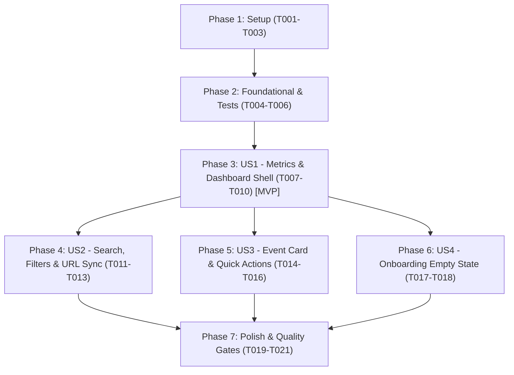

# Tasks: Organizer Multi-Event Overview Dashboard & Management Portal

**Branch**: `007-organizer-events-dashboard` | **Date**: 2026-09-27 | **Spec**: [spec.md](./spec.md) | **Plan**: [plan.md](./plan.md)

## Phase 1: Setup (Shared Infrastructure)

**Purpose**: Establish type definitions, query validation contracts, and directory structure.

- [x] T001 [P] Create DTO and domain interfaces in `src/features/events/types/dashboard-overview.ts`
- [x] T002 [P] Create Zod schema for query parsing (`status`, `q`, `page`, `limit`) in `src/lib/validations/dashboard-query.ts`
- [x] T003 [P] Implement metric calculation and live status utility functions in `src/features/events/utils/dashboard-metrics.ts`

---

## Phase 2: Foundational (Blocking Prerequisites)

**Purpose**: Core data aggregation and test baseline before building UI components.

- [x] T004 [P] Create unit test suite for query validation and metrics calculation in `tests/unit/events/dashboard-overview.test.ts`
- [x] T005 Create loading skeleton component in `src/app/(dashboard)/loading.tsx`
- [x] T006 [P] Create redirect route handler from `/events` to `/dashboard` in `src/app/(dashboard)/events/page.tsx`

**Checkpoint**: Core foundation, validation schemas, and test fixtures are ready.

---

## Phase 3: User Story 1 - Multi-Event Overview & Aggregate Metrics (Priority: P1) 🎯 MVP

**Goal**: Authenticated organizers can load `/dashboard` to see summary cards (Total Events, Live Events, Candidates, Votes) and their owned event list with strict multi-tenant isolation.

**Independent Test**: Log in as an organizer and navigate to `/dashboard` to verify authentication guard, aggregate stats computation, and owned events retrieval.

### Implementation for User Story 1

- [x] T007 [P] [US1] Create top greeting & action banner component in `src/features/events/components/dashboard-overview/DashboardGreetingBanner.tsx`
- [x] T008 [P] [US1] Create 4-card metric summary component in `src/features/events/components/dashboard-overview/DashboardMetricsCards.tsx`
- [x] T009 [US1] Implement Server Component page in `src/app/(dashboard)/page.tsx` with session authentication via `getSession()`, multi-tenant Prisma query (`where: { organizerId }`), and metric aggregation
- [x] T010 [US1] Implement container shell with `<Suspense>` boundary in `src/features/events/components/dashboard-overview/EventsDashboardClient.tsx`

**Checkpoint**: User Story 1 delivers a functional MVP dashboard displaying live organizer metrics and owned events.

---

## Phase 4: User Story 2 - Real-Time Search & Lifecycle Status Filtering (Priority: P2)

**Goal**: Organizers can filter their events by status (`ALL`, `PUBLISHED`, `DRAFT`, `ARCHIVED`), search by title/slug/description, and paginate across pages (12 cards/page) with URL sync via `nuqs`.

**Independent Test**: Apply status filter tabs and enter search terms in the dashboard search bar, confirming the visible cards update instantly and URL updates with `?status=...&q=...`.

### Implementation for User Story 2

- [x] T011 [US2] Implement `nuqs` URL state synchronization hooks (`status`, `q`, `page`) in `src/features/events/components/dashboard-overview/EventsDashboardClient.tsx`
- [x] T012 [US2] Implement search input bar and status filter pill navigation in `src/features/events/components/dashboard-overview/EventsDashboardClient.tsx`
- [x] T013 [US2] Implement client-side pagination controls (12 items per page with Prev/Next buttons) in `src/features/events/components/dashboard-overview/EventsDashboardClient.tsx`

**Checkpoint**: User Story 2 enables instant search, status filtering, pagination, and bookmarkable URL state.

---

## Phase 5: User Story 3 - Quick Action Routing & Public Link Sharing (Priority: P3)

**Goal**: Render interactive event cards with photo banners, publication status badges (Live Voting, Draft, Completed), Candidate & Settings navigation buttons, and 1-click clipboard URL copying with toast confirmation.

**Independent Test**: Click Candidate, Settings, and Share Link buttons on an event card to verify routing and clipboard copy toast.

### Implementation for User Story 3

- [x] T014 [US3] Create `EventCard.tsx` component with banner preview, pulsing live badge, metrics summary, and action buttons in `src/features/events/components/dashboard-overview/EventCard.tsx`
- [x] T015 [US3] Add 1-click clipboard copy utility with toast notification feedback in `src/features/events/components/dashboard-overview/EventCard.tsx`
- [x] T016 [US3] Integrate `EventCard.tsx` into the events grid in `EventsDashboardClient.tsx`

**Checkpoint**: User Story 3 provides comprehensive event card interactions and quick operational links.

---

## Phase 6: User Story 4 - Empty State & First-Time Onboarding (Priority: P4)

**Goal**: Display an engaging zero-state illustration and onboarding call-to-action to create an event when an organizer has no registered events.

**Independent Test**: Log in with an account having 0 events and verify the onboarding empty state renders with a primary "Create Your First Event" button.

### Implementation for User Story 4

- [x] T017 [US4] Create `DashboardEmptyState.tsx` component with onboarding guidance and primary "Create Your First Event" button in `src/features/events/components/dashboard-overview/DashboardEmptyState.tsx`
- [x] T018 [US4] Conditionally render `DashboardEmptyState.tsx` when `events.length === 0` in `EventsDashboardClient.tsx`

**Checkpoint**: User Story 4 ensures a smooth onboarding path for first-time organizers.

---

## Phase 7: Polish & Cross-Cutting Quality Gates

**Purpose**: Automated test validation, linting, accessibility verification, and performance confirmation.

- [x] T019 [P] Run Vitest test suite (`npm run test:unit -- tests/unit/events/dashboard-overview.test.ts`)
- [x] T020 Run TypeScript typecheck (`npm run typecheck`) and ESLint (`npm run lint`)
- [x] T021 Execute manual verification per `quickstart.md` and verify zero accessibility/console errors

---

## Dependencies & Execution Order

---

## Implementation Strategy

1. **MVP First**: Complete Phases 1, 2, and 3 (US1). Verify that `/dashboard` loads, authenticates, queries DB, and displays aggregate statistics with basic event lists.
2. **Interactive Increments**: Add Search/Filter (US2), Event Card Actions (US3), and Empty State (US4).
3. **Quality Gate**: Run Vitest test suites, full typecheck, and lint verification before committing.
