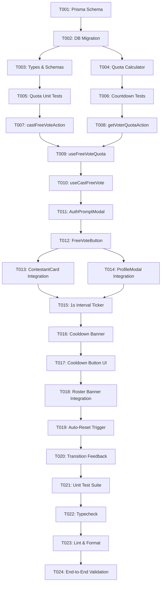

# Tasks: Cast Free Daily Votes & 24-Hour Cooldown Engine (VS-28)

**Feature Branch**: `012-free-daily-voting`  
**Input**: [spec.md](spec.md) | [plan.md](plan.md) | [data-model.md](data-model.md) | [contracts/voting-api.md](contracts/voting-api.md)

---

## Phase 1: Setup & Data Infrastructure

**Purpose**: Initialize database schema for votes and core voting feature module structure.

- [x] T001 Update Prisma schema with `Vote` model and `VoteType` enum in `prisma/schema.prisma`
- [x] T002 Apply Prisma database migration and regenerate client in `prisma/migrations/`
- [x] T003 [P] Create voting feature domain types, DTOs, and Zod schemas in `src/features/voting/types/index.ts`
- [x] T004 [P] Create quota calculation and reset window utility in `src/features/voting/utils/quota-calculator.ts`

---

## Phase 2: Foundational Unit Tests (TDD)

**Purpose**: Ensure rock-solid business logic for rolling 24-hour quota calculation and time formatting before wiring UI.

- [x] T005 [P] Unit tests for rolling 24-hour quota calculation logic in `tests/unit/voting/quota-calculator.test.ts`
- [x] T006 [P] Unit tests for remaining time countdown string formatter in `tests/unit/voting/countdown-formatter.test.ts`

---

## Phase 3: User Story 1 - Authenticated Supporter Casts Free Daily Vote (Priority: P1) 🎯 MVP

**Goal**: Allow authenticated voters to cast available free daily votes on candidates with atomic ledger persistence, total tally increments, and balance tracking.

**Independent Test**: As an authenticated user, click "Cast Free Vote" on a contestant in an active event; verify that the contestant's vote count increments by 1, the vote is logged in the database, and remaining balance decreases.

### Implementation for User Story 1

- [x] T007 [US1] Implement atomic `castFreeVoteAction` server action with quota check and transaction in `src/features/voting/actions/cast-free-vote.ts`
- [x] T008 [US1] Implement `getVoterQuotaAction` server action to fetch voter's rolling 24h quota status in `src/features/voting/actions/get-voter-quota.ts`
- [x] T009 [US1] Implement `useFreeVoteQuota` TanStack Query hook in `src/features/voting/hooks/use-free-vote-quota.ts`
- [x] T010 [US1] Implement `useCastFreeVote` mutation hook with optimistic cache updates in `src/features/voting/hooks/use-cast-free-vote.ts`
- [x] T011 [US1] Create `AuthPromptModal` dialog prompting unauthenticated visitors to sign in in `src/features/voting/components/AuthPromptModal.tsx`
- [x] T012 [US1] Create `FreeVoteButton` component with dynamic allowance counter pill in `src/features/voting/components/FreeVoteButton.tsx`
- [x] T013 [US1] Integrate `FreeVoteButton` and quota state into `src/features/contestants/components/ContestantCard.tsx`
- [x] T014 [US1] Integrate `FreeVoteButton` and quota state into `src/features/contestants/components/ContestantProfileModal.tsx`

---

## Phase 4: User Story 2 - Quota Exhaustion & 24-Hour Cooldown Feedback (Priority: P2)

**Goal**: When a voter uses all daily free votes, disable free voting buttons and display a live countdown timer showing the time remaining until reset.

**Independent Test**: Exhaust all free votes for an active event; verify that the button disables, displays `"Daily free votes used — Next vote in [HH:MM:SS]"`, and ticks down every second.

### Implementation for User Story 2

- [x] T015 [US2] Extend `useFreeVoteQuota` hook with 1-second interval ticker and server-aligned timestamp in `src/features/voting/hooks/use-free-vote-quota.ts`
- [x] T016 [US2] Create `FreeVoteCooldownBanner` component displaying active cooldown status and reset timer in `src/features/voting/components/FreeVoteCooldownBanner.tsx`
- [x] T017 [US2] Update `FreeVoteButton` with disabled cooldown styling, live countdown text, and paid boost prompt in `src/features/voting/components/FreeVoteButton.tsx`
- [x] T018 [US2] Integrate `FreeVoteCooldownBanner` into the event contestant roster view in `src/features/contestants/components/ContestantRoster.tsx`

---

## Phase 5: User Story 3 - Automatic Rolling Cooldown Expiration & Daily Allowance Restoration (Priority: P3)

**Goal**: Automatically transition UI from cooldown back to active with full allowance restored when the 24-hour timer reaches zero.

**Independent Test**: When the countdown timer reaches zero, verify the query cache invalidates and the vote action button re-enables automatically.

### Implementation for User Story 3

- [x] T019 [US3] Add automatic TanStack Query cache invalidation trigger when countdown reaches zero in `src/features/voting/hooks/use-free-vote-quota.ts`
- [x] T020 [US3] Add client-side visual restoration transition effect on `FreeVoteButton` in `src/features/voting/components/FreeVoteButton.tsx`

---

## Phase 6: Polish & Quality Gates

**Purpose**: Verify end-to-end functionality, strict type checking, and UI responsiveness across desktop and mobile.

- [x] T021 [P] Run Vitest unit test suite to verify 100% pass rate in `tests/unit/voting/`
- [x] T022 [P] Verify TypeScript strict mode with zero errors (`npm run typecheck`)
- [x] T023 [P] Verify ESLint and Prettier formatting (`npm run lint` & `npm run format:check`)
- [x] T024 Perform end-to-end verification of free voting flows following `specs/012-free-daily-voting/quickstart.md`

---

## Dependencies & Execution Order

---

## Implementation Strategy

### MVP Milestone (User Story 1 Only)

1. Complete Phase 1 (Database schema and migration)
2. Complete Phase 2 (Foundational tests)
3. Complete Phase 3 (User Story 1: Free vote submission & balance tracking)
4. Validate MVP voting capability independently on `/events/[slug]`

### Full Experience Delivery

1. Add User Story 2 (Cooldown banner, live timer, and disabled states)
2. Add User Story 3 (Auto-invalidation and restoration animations)
3. Execute Phase 6 quality gates and Jira transition
