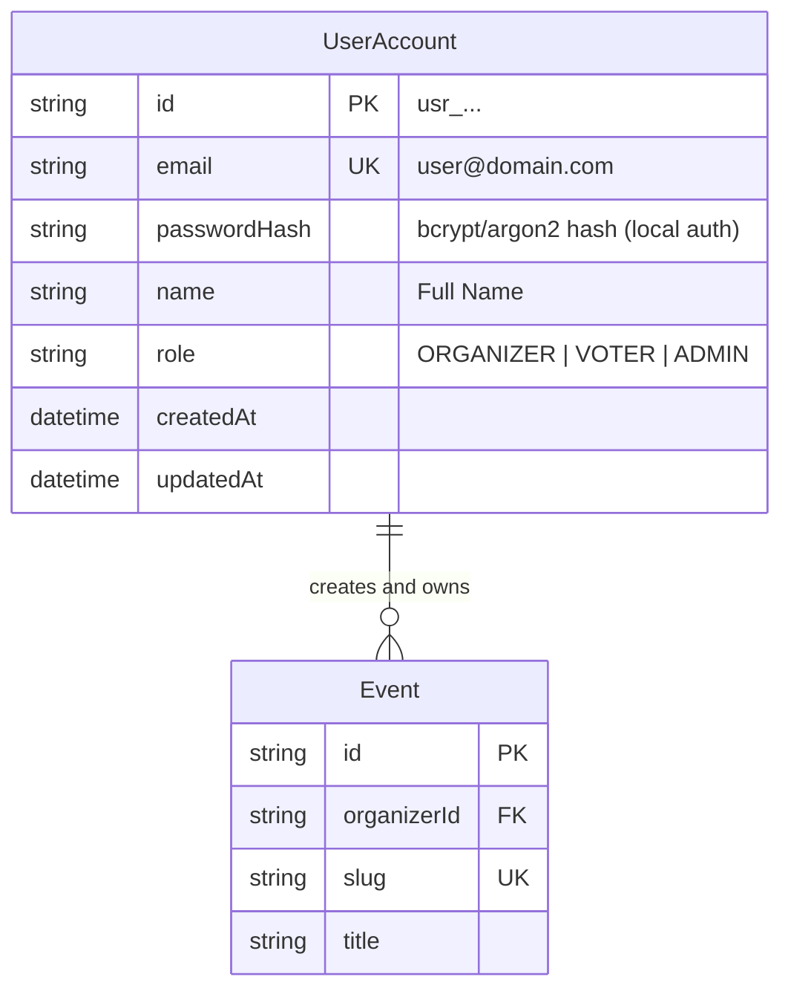

# Data Model: Organizer Authentication & User Entities

## 1. Entities & Schema Representation



### TypeScript DTO Definitions

```typescript
export type UserRole = "ORGANIZER" | "VOTER" | "ADMIN";

export interface UserSessionDto {
  userId: string;
  email: string;
  name: string;
  role: UserRole;
  avatarUrl?: string | null;
  expiresAt: string;
}

export interface LoginCredentialsDto {
  email: string;
  password?: string;
  isDemoLogin?: boolean;
}

export interface RegisterOrganizerDto {
  name: string;
  email: string;
  password?: string;
  organizationName?: string;
}

export interface AuthResponseDto {
  success: boolean;
  user?: UserSessionDto;
  redirectTo?: string;
  error?: string;
}
```

---

## 2. JWT Token Payload Structure (Cognito-Aligned)

```json
{
  "sub": "usr_organizer_mock_01",
  "email": "organizer@electa.ph",
  "name": "Alex Gonzaga (Demo Organizer)",
  "cognito:groups": ["ORGANIZER"],
  "custom:role": "ORGANIZER",
  "token_use": "id",
  "iss": "https://cognito-idp.ap-southeast-1.amazonaws.com/localstack_pool",
  "iat": 1790606000,
  "exp": 1791210800
}
```
