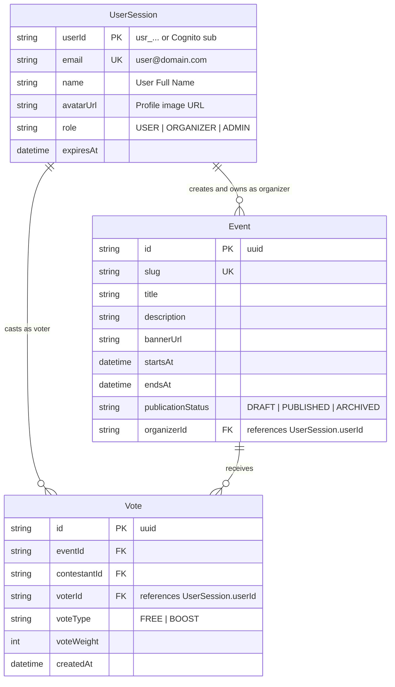

# Data Model: Electa Unified Authentication & User Entities

## 1. Entities & Schema Representation



---

## 2. TypeScript DTO Definitions

```typescript
export type UserRole = "USER" | "ORGANIZER" | "ADMIN";

export interface UserSessionDto {
  userId: string;
  email: string;
  name?: string | undefined;
  role?: UserRole | string | undefined;
  avatarUrl?: string | null | undefined;
  organizationName?: string | null | undefined;
  expiresAt?: string | undefined;
}

export interface LoginCredentialsDto {
  email: string;
  password?: string | undefined;
  isDemoLogin?: boolean | undefined;
  returnTo?: string | undefined;
}

export interface RegisterUserDto {
  name: string;
  email: string;
  password?: string | undefined;
  organizationName?: string | undefined;
  returnTo?: string | undefined;
}

export interface AuthResponseDto {
  success: boolean;
  user?: UserSessionDto | undefined;
  redirectTo?: string | undefined;
  error?:
    | {
        code: string;
        message: string;
      }
    | undefined;
}
```

---

## 3. JWT Token Claims (AWS Cognito Aligned)

```json
{
  "sub": "usr_organizer_mock_01",
  "email": "user@electa.ph",
  "name": "Alex Gonzaga",
  "cognito:groups": ["USER"],
  "custom:role": "USER",
  "token_use": "id",
  "iss": "https://cognito-idp.ap-southeast-1.amazonaws.com/localstack_pool",
  "iat": 1790606000,
  "exp": 1791210800
}
```
