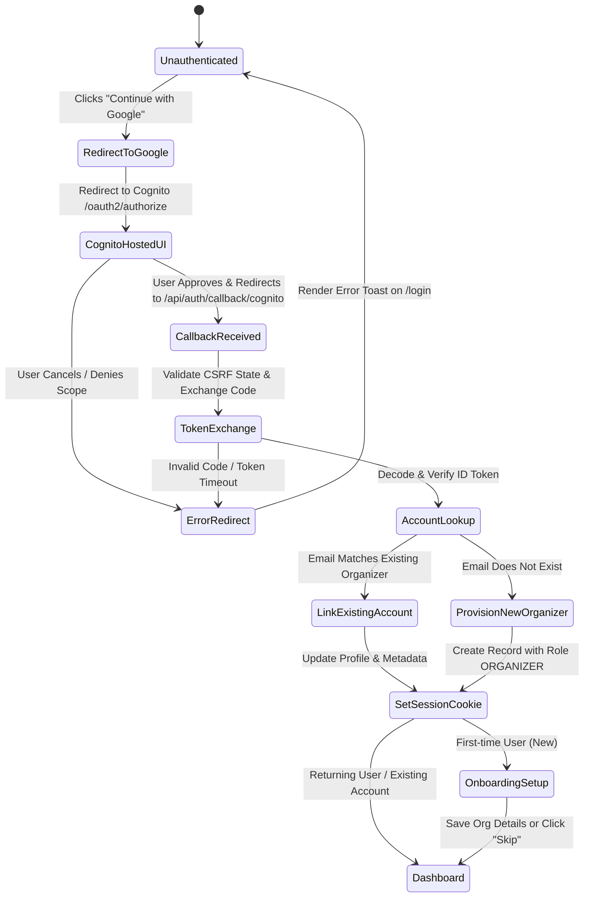

# Data Model: AWS Cognito Federated Google Identity Provider & Account Linking

## Entities & Schemas

### 1. Organizer Identity & Profile Representation

```typescript
export interface OrganizerIdentity {
  id: string; // Internal unique organizer ID (e.g. usr_...)
  email: string; // Verified email address
  name: string; // Full display name
  avatarUrl?: string; // Profile image / avatar from Google profile
  cognitoSub: string; // Subject ID from AWS Cognito token
  provider: "COGNITO" | "GOOGLE"; // Primary or federated identity provider
  organizationName?: string; // Optional organization/event team name
  createdAt: Date;
  updatedAt: Date;
}
```

### 2. Session Token Payload (`CognitoTokenPayload` Extension)

Extends the verified Cognito ID token payload:

```typescript
export interface CognitoTokenPayload {
  sub: string;
  email: string;
  name: string;
  identities?: Array<{
    userId: string;
    providerName: "Google" | "COGNITO";
    providerType: string;
    issuer: string | null;
    primary: boolean;
    dateCreated: number;
  }>;
  "cognito:groups"?: string[];
  "custom:role"?: string;
  token_use: "id" | "access";
  iss: string;
  iat: number;
  exp: number;
}
```

### 3. Client Session Object (`UserSessionDto`)

```typescript
export interface UserSessionDto {
  userId: string;
  email: string;
  name: string;
  avatarUrl?: string;
  role: "ORGANIZER" | "ADMIN" | "VOTER";
  organizationName?: string;
  isNewUser?: boolean;
  expiresAt?: string;
}
```

### 4. OAuth State & Nonce (`OAuthStatePayload`)

Stored in short-lived HTTP-only cookie (`electa_oauth_state`) during OAuth redirection:

```typescript
export interface OAuthStatePayload {
  state: string; // Cryptographic random UUID / hex string
  nonce: string; // Replay-prevention nonce
  returnTo?: string; // Deep link redirect target (default: /dashboard)
  createdAt: number; // Timestamp (valid for 10 minutes)
}
```

## State Transitions & Account Linking Lifecycle


