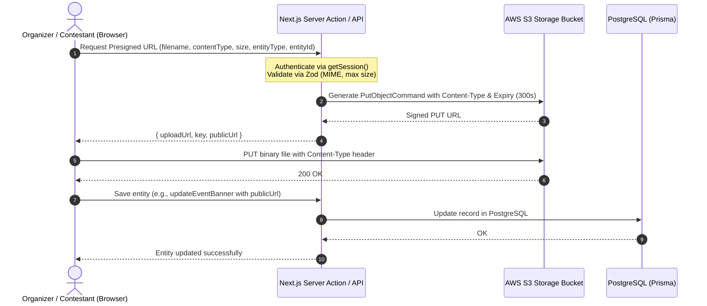

# Data Model: S3 Storage & Upload Entities

## 1. Upload Flow & Entity Relationships



---

## 2. TypeScript DTO Definitions

```typescript
export type UploadEntityType = "event_banner" | "contestant_avatar" | "category_badge" | "sponsor_logo";

export type AllowedMimeType = "image/jpeg" | "image/png" | "image/webp" | "image/avif";

export interface PresignedUploadRequestDto {
  filename: string;
  contentType: AllowedMimeType;
  fileSizeBytes: number;
  entityType: UploadEntityType;
  entityId: string;
}

export interface PresignedUploadResponseDto {
  uploadUrl: string;
  key: string;
  publicUrl: string;
  expiresInSeconds: number;
}

export interface UploadedAssetDto {
  key: string;
  publicUrl: string;
  contentType: string;
  fileSizeBytes: number;
  uploadedAt: string;
}
```

---

## 3. Zod Validation Rules

```typescript
import { z } from "zod";

export const ALLOWED_MIME_TYPES = [
  "image/jpeg",
  "image/png",
  "image/webp",
  "image/avif",
] as const;

export const MAX_FILE_SIZE_BYTES: Record<string, number> = {
  event_banner: 10 * 1024 * 1024,      // 10 MB
  contestant_avatar: 5 * 1024 * 1024,   // 5 MB
  category_badge: 2 * 1024 * 1024,      // 2 MB
  sponsor_logo: 5 * 1024 * 1024,        // 5 MB
};

export const presignedUploadRequestSchema = z.object({
  filename: z.string().min(1).max(255),
  contentType: z.enum(ALLOWED_MIME_TYPES, {
    errorMap: () => ({ message: "Only JPEG, PNG, WebP, and AVIF images are allowed." }),
  }),
  fileSizeBytes: z.number().positive(),
  entityType: z.enum(["event_banner", "contestant_avatar", "category_badge", "sponsor_logo"]),
  entityId: z.string().min(1),
}).refine(
  (data) => {
    const limit = MAX_FILE_SIZE_BYTES[data.entityType] || (5 * 1024 * 1024);
    return data.fileSizeBytes <= limit;
  },
  {
    message: "File exceeds the maximum allowable size for this asset type.",
    path: ["fileSizeBytes"],
  }
);
```

---

## 4. S3 Object Key Partitioning

| Entity Type | Key Format Pattern | Example |
| :--- | :--- | :--- |
| `event_banner` | `events/{entityId}/banners/{uuid}.{ext}` | `events/evt_991/banners/a1b2c3d4-e5f6.webp` |
| `contestant_avatar` | `contestants/{entityId}/avatars/{uuid}.{ext}` | `contestants/cnt_442/avatars/f1e2d3c4-b5a6.jpg` |
| `category_badge` | `events/{entityId}/badges/{uuid}.{ext}` | `events/evt_991/badges/99887766-5544.png` |
| `sponsor_logo` | `events/{entityId}/sponsors/{uuid}.{ext}` | `events/evt_991/sponsors/11223344-aabb.webp` |
