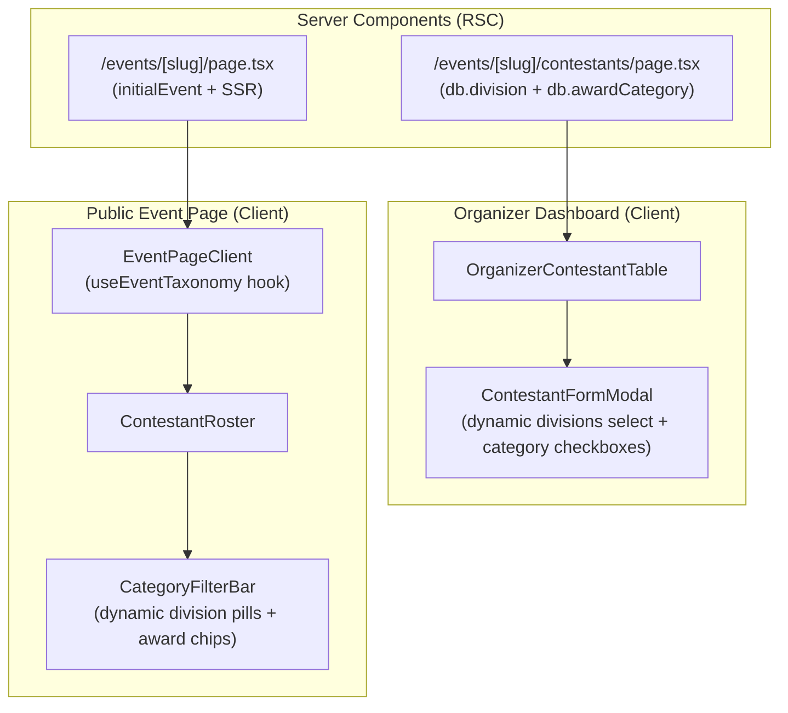

# Implementation Plan: Dynamic Category Integration in Contestant Form & Public Roster Filter Bar

**Branch**: `015-dynamic-category-integration` | **Date**: 2026-10-01 | **Spec**: [specs/015-dynamic-category-integration/spec.md](spec.md)  
**Input**: Feature specification from `specs/015-dynamic-category-integration/spec.md` (Jira: [VS-38](https://the-three-devsketeers.atlassian.net/browse/VS-38), Epic: [VS-35](https://the-three-devsketeers.atlassian.net/browse/VS-35))

---

## Summary

Integrate dynamic competition divisions and award categories into the organizer candidate registration workflow (`ContestantFormModal`, `OrganizerContestantTable`, `/events/[slug]/contestants`) and the public candidate roster (`CategoryFilterBar`, `ContestantRoster`, `/events/[slug]`). Event organizers will select from the event's configured competition divisions (or fallback enums) when creating or editing candidates, and voters on the public event page will filter candidates using dynamic division pills matching the event's active divisions ("All Candidates", "Kids", "Teens", "Adults").

---

## Technical Context

**Language/Version**: TypeScript 5.7+ (strict mode enabled, zero `any`, zero non-null assertions `!`)  
**Primary Dependencies**: Next.js 16 (App Router & RSC), React 19, `@tanstack/react-query`, `lucide-react`, `zod`  
**Storage**: PostgreSQL via Supabase with Prisma ORM (`Division`, `AwardCategory`, `Contestant`)  
**Testing**: Vitest + React Testing Library (`tests/unit/contestants/`)  
**Target Platform**: Responsive Web (Mobile & Desktop, WCAG 2.1 AA compliant)  
**Performance Goals**: Instant client-side roster filtering in < 50ms, zero extra network roundtrips on filter toggle  
**Constraints**: Zero breaking changes to existing contestants with legacy enum divisions; full keyboard navigation & accessibility for filter pills and form dropdowns

---

## Constitution Check

| Principle                                 | Requirement                                                         | Status   | Evidence / Notes                                                                                              |
| :---------------------------------------- | :------------------------------------------------------------------ | :------- | :------------------------------------------------------------------------------------------------------------ |
| **I. Strict Type Safety**                 | Zero `any`, explicit interfaces, Zod boundary validation            | **PASS** | `ContestantFormModalProps` and `CategoryFilterBarProps` typed with `DivisionDto[]` / `DynamicDivisionItem[]`. |
| **II. Server-First & Boundary Isolation** | RSC default, `"use client"` only for interactive components         | **PASS** | Server components (`/events/[slug]/contestants/page.tsx`) query `db.division.findMany` and pass data down.    |
| **III. State Separation**                 | Server state via TanStack Query / RSC; URL state for filters        | **PASS** | Client filters sync to URL search params (`?division=...&category=...`).                                      |
| **IV. Secure-by-Design**                  | Session verification via `requireEventOwnership()`                  | **PASS** | Contestants management protected by `requireEventOwnership(slug)` and Cognito session checks.                 |
| **V. Feature Colocation**                 | Colocated in `src/features/contestants/` and `src/features/events/` | **PASS** | Components, hooks, types, and tests colocated in their respective feature slices.                             |
| **VI. Test-First Quality**                | Vitest unit tests verifying ACs before final delivery               | **PASS** | Unit tests planned for dynamic modal dropdown and dynamic roster filter pills.                                |

---

## Architecture & Integration Points

### 1. `ContestantFormModal.tsx`

- Add `divisions?: DivisionDto[] | DynamicDivisionItem[]` to `ContestantFormModalProps`.
- If `divisions && divisions.length > 0`:
  - Render each division as an `<option value={div.name}>{div.name}</option>` (or division ID/name).
  - Pre-select `initialData?.divisionRef?.name` or `initialData?.division` or the first division.
- If `!divisions || divisions.length === 0`:
  - Render fallback standard options: `Female`, `Male`, `LGBTQ+`, `Teen`.
- Include `divisionId` in form state and pass to `onSubmit` when matching a custom division.

### 2. `OrganizerContestantTable.tsx` & `/events/[slug]/contestants/page.tsx`

- Update `/events/[slug]/contestants/page.tsx` to query `db.division.findMany({ where: { eventId: event.id }, orderBy: { displayOrder: "asc" } })`.
- Pass `divisions` into `OrganizerContestantTable`.
- Update `OrganizerContestantTable` to pass `divisions` into `ContestantFormModal`.
- Display the human-readable division name in the table column.

### 3. `CategoryFilterBar.tsx` & `ContestantRoster.tsx`

- Ensure `CategoryFilterBar` cleanly renders division pills for all passed `divisions`.
- Update `ContestantRoster.tsx` filter logic so that `selectedDivision` matches:
  - Exact division name (e.g., "Kids", "Teens", "Adults")
  - `c.divisionRef?.name` or `c.divisionName`
  - Fallback normalized enum matches for standard presets ("Female", "Male", etc.)
- Retain sub-50ms instant client-side filtering and URL sync.

---

## Testing Plan

1. **`tests/unit/contestants/contestant-form-modal.test.tsx`**:
   - Verify modal renders custom divisions ("Kids", "Teens", "Adults") when provided in `divisions` prop.
   - Verify modal falls back to default divisions ("Female", "Male", "LGBTQ+", "Teen") when `divisions` is empty.
   - Verify selecting a custom division and submitting calls `onSubmit` with selected values.
   - Verify active award categories are rendered as checkboxes.

2. **`tests/unit/contestants/category-filter.test.ts` / `.tsx`**:
   - Verify `CategoryFilterBar` renders dynamic division pills matching custom divisions plus "All Candidates".
   - Verify selecting a pill triggers `onSelectDivision` callback.
   - Verify `ContestantRoster` filters candidate cards by custom division name immediately.
