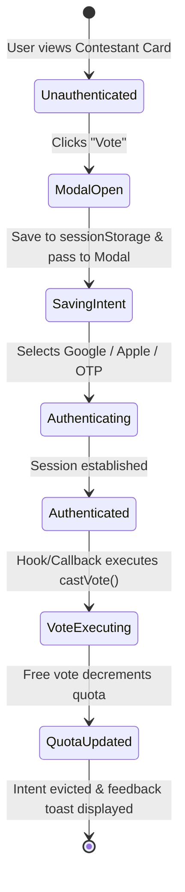

# Data Model: Frictionless Voter Authentication Modal (VS-27)

**Feature**: `017-frictionless-voter-auth-modal`  
**Date**: 2026-10-02

---

## 1. Client Entities & Data Structures

### `PendingVoteIntent` (Transient Session Storage)

Tracks an unauthenticated voter's candidate selection and action before and during the inline authentication modal or OAuth external redirects.

```typescript
export interface PendingVoteIntent {
  /** Target Event UUID */
  eventId: string;
  /** Chosen Pageant Contestant UUID */
  contestantId: string;
  /** Display candidate name for modal heading */
  contestantName?: string | undefined;
  /** Optional Award Category UUID (e.g. Best in Swimsuit) */
  awardCategoryId?: string | undefined;
  /** Vote tier / type */
  voteType?: "FREE" | "BOOST" | undefined;
  /** Unix millisecond epoch timestamp when intent was created */
  timestamp: number;
}
```

**Storage & TTL Invariants**:

- Stored in browser `sessionStorage` under the key: `electa_pending_vote_intent`.
- Expiration: 15 minutes (`900,000` ms). Any intent older than 15 minutes is treated as stale and evicted upon retrieval.

---

## 2. Server & Authentication State Entities

### `UserSessionDto` (Zustand & Auth Adapter)

```typescript
export interface UserSessionDto {
  id: string;
  email: string | null;
  phone: string | null;
  fullName: string | null;
  role: "VOTER" | "ORGANIZER" | "ADMIN";
  isAnonymous: boolean;
  cognitoSub: string;
}
```

### `VoterQuotaStateDto`

```typescript
export interface VoterQuotaStateDto {
  dailyLimit: number;
  votesUsedIn24h: number;
  remainingVotes: number;
  isFreeVotingEnabled: boolean;
  isEventActive: boolean;
  isInCooldown: boolean;
  nextResetTime: string | null;
}
```

---

## 3. State Transitions & Lifecycle


