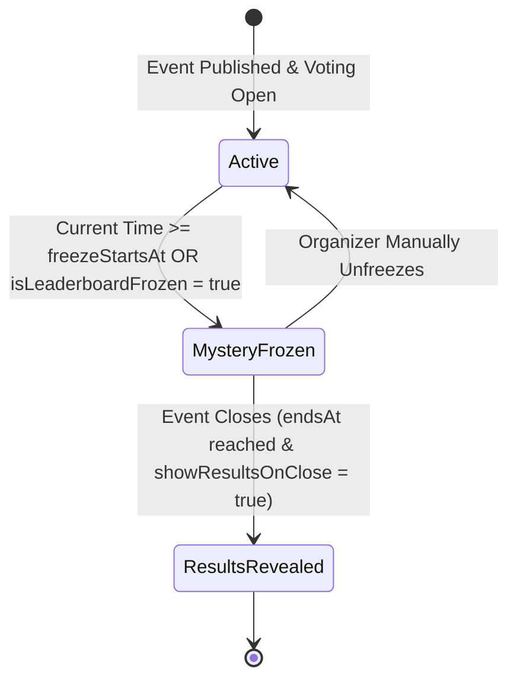

# Data Model: Real-Time Live Leaderboard & Stealth Mystery Freeze

**Feature**: `019-realtime-leaderboard-mystery-freeze`  
**Jira Key**: `VS-22`  
**Date**: 2026-10-02

---

## 1. Entities & TypeScript Interfaces

### LeaderboardEntry

Represents an individual contestant's standing on the leaderboard.

```typescript
export interface LeaderboardEntry {
  id: string;
  contestantNumber: number;
  name: string;
  avatarUrl: string;
  divisionId?: string | null;
  divisionName?: string | null;
  voteCount: number | null; // null during Mystery Freeze for public clients
  rank: number | null; // null during Mystery Freeze for public clients
  percentageShare: number; // 0-100% of total category votes
  gapToLeader: number; // Difference in votes to #1 rank (0 if #1)
  gapToAhead: number; // Difference in votes to (rank - 1)
  isPodium: boolean; // true if rank in [1, 2, 3]
}
```

### LeaderboardPayload

Represents the complete API response returned from `/api/events/[slug]/leaderboard`.

```typescript
export interface LeaderboardPayload {
  eventId: string;
  eventSlug: string;
  eventTitle: string;
  isFrozen: boolean;
  freezeMessage?: string;
  totalVotes: number | null;
  selectedDivisionId?: string | null;
  selectedCategoryId?: string | null;
  entries: LeaderboardEntry[];
  lastUpdated: string; // ISO 8601 string
}
```

### EventFreezeSettings

Schema extensions / derived state for Event mystery freeze configuration:

```typescript
export interface EventFreezeSettings {
  isLeaderboardFrozen: boolean;
  freezeStartsAt?: string | null; // ISO 8601 string
  freezeEndsAt?: string | null;
  freezeNoticeText?: string;
}
```

---

## 2. State Machine: Leaderboard Freeze Status


