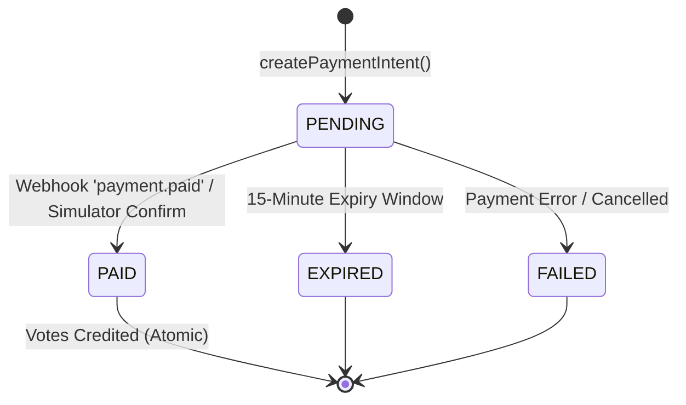

# Data Model: Philippine Payment Rails & Dynamic QR Ph Engine (VS-21)

## 1. Database Schema Additions (`prisma/schema.prisma`)

```prisma
enum PaymentStatus {
  PENDING
  PAID
  FAILED
  EXPIRED
  REFUNDED
}

enum PaymentProvider {
  PAYMONGO
  MOCK
}

enum PaymentChannel {
  QR_PH
  GCASH
  MAYA
  CARD
  GRAB_PAY
  ONLINE_BANKING
}

model PaymentTransaction {
  id                      String          @id @default(uuid())
  referenceNumber         String          @unique
  eventId                 String
  contestantId            String
  awardCategoryId         String?
  voterIdentifier         String
  amountInPhp             Decimal         @db.Decimal(10, 2)
  amountInCents           Int
  votesAwarded            Int
  bonusVotes              Int             @default(0)
  status                  PaymentStatus   @default(PENDING)
  provider                PaymentProvider @default(PAYMONGO)
  paymentChannel          PaymentChannel  @default(QR_PH)

  // PayMongo & Gateway references
  paymongoPaymentIntentId String?         @unique
  paymongoPaymentMethodId String?
  paymongoClientKey       String?
  qrCodeUrl               String?
  qrCodeString            String?         @db.Text
  checkoutUrl             String?
  paidAt                  DateTime?
  failedAt                DateTime?
  failureReason           String?
  metadata                Json?

  createdAt               DateTime        @default(now())
  updatedAt               DateTime        @updatedAt

  event                   Event           @relation(fields: [eventId], references: [id], onDelete: Cascade)
  contestant              Contestant      @relation(fields: [contestantId], references: [id], onDelete: Cascade)
  votes                   Vote[]

  @@index([eventId, status])
  @@index([contestantId])
  @@index([voterIdentifier])
  @@index([referenceNumber])
  @@index([createdAt])
}
```

## 2. State Machine for Transactions


