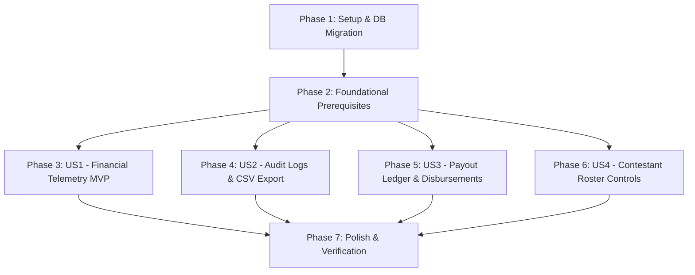

# Tasks: Organizer Command Center, Revenue Tracker & Payout Ledger (VS-24)

**Feature**: [spec.md](file:///c:/Users/Roselle%20Tabuena/workspace/vote-sphere-workspace/vote-sphere/specs/023-organizer-revenue-payout-ledger/spec.md) | **Plan**: [plan.md](file:///c:/Users/Roselle%20Tabuena/workspace/vote-sphere-workspace/vote-sphere/specs/023-organizer-revenue-payout-ledger/plan.md)  
**Status**: Ready for Implementation

---

## Phase 1: Setup (Shared Infrastructure)

**Purpose**: Database schema expansion, Prisma migration, and shared TypeScript domain definitions.

- [x] T001 Add `takeRatePercentage` to `Event` model and create `PayoutRequest` model with `PayoutStatus` and `PayoutMethod` enums in `prisma/schema.prisma`
- [x] T002 Apply Prisma migration and regenerate client via `npx prisma migrate dev --name add_payout_ledger_and_take_rate` in `vote-sphere/`
- [x] T003 [P] Create TypeScript domain interfaces and Zod validation schemas in `src/features/events/types/revenue.ts` and `src/lib/validations/payout.ts`

---

## Phase 2: Foundational (Blocking Prerequisites)

**Purpose**: Deterministic fee calculators, voter privacy utilities, and dashboard navigation.

**⚠️ CRITICAL**: Must complete before implementing User Story components.

- [x] T004 [P] Implement deterministic per-channel payment gateway fee calculator (QR Ph 1.5%, GCash/Maya 2.0%, Card 3.5% + ₱15) in `src/features/payments/utils/gateway-fees.ts`
- [x] T005 [P] Implement salted SHA-256 voter IP hasher and voter ID masker in `src/features/events/utils/ip-hasher.ts`
- [x] T006 Update `src/features/events/components/dashboard/OrganizerDashboardHeader.tsx` to add "Revenue & Payouts" navigation tab linking to `/events/[slug]/revenue`

**Checkpoint**: Foundation ready — database models and shared utility functions are complete.

---

## Phase 3: User Story 1 - Real-Time Financial Telemetry & Fee Transparency (Priority: P1) 🎯 MVP

**Goal**: Deliver a real-time revenue telemetry dashboard showing Gross Sales, Gateway Fees, Admin-controlled Take-Rate (default 12%), and Net Organizer Revenue.

**Independent Test**: Navigate to `/events/[slug]/revenue` as an organizer with confirmed paid boost transactions; verify that the 5 metric cards accurately aggregate gross revenue, deduct exact gateway fees, deduct the configured take-rate, display net balance, and verify take-rate is read-only for organizers.

### Tests for User Story 1 🧪

> **NOTE: Write these tests FIRST, ensure they FAIL before implementation**

- [x] T007 [P] [US1] Unit tests for gross, fee, take-rate, and net balance aggregation math in `tests/unit/events/financial-metrics.test.ts`

### Implementation for User Story 1

- [x] T008 [US1] Implement financial aggregation service computing gross sales, gateway fees, platform take-rate, and net proceeds using Decimal math in `src/features/events/services/financial-metrics.ts`
- [x] T009 [P] [US1] Implement financial telemetry Route Handler returning standard `ApiResponse<T>` in `src/app/api/events/[slug]/finance/metrics/route.ts`
- [x] T010 [P] [US1] Implement Server Action for platform admin take-rate customization with HTTP 403 authorization guard in `src/features/events/actions/update-take-rate.ts`
- [x] T011 [P] [US1] Build responsive zero-radius financial KPI metric cards (`RevenueSummaryCards`) in `src/features/events/components/revenue/RevenueSummaryCards.tsx`
- [x] T012 [P] [US1] Build revenue breakdown tables by contestant and payment channel in `src/features/events/components/revenue/ContestantRevenueShareTable.tsx` and `src/features/events/components/revenue/PaymentChannelBreakdownCard.tsx`
- [x] T013 [US1] Assemble main organizer revenue command center page with Server Component data fetching and Suspense in `src/app/(dashboard)/events/[slug]/revenue/page.tsx`

**Checkpoint**: User Story 1 (MVP) is fully functional and independently verifiable.

---

## Phase 4: User Story 2 - Exportable Transaction & Fraud Audit Logs (Priority: P2)

**Goal**: Provide a tamper-evident, privacy-safe transaction audit log table with contestant and payment channel filters, masked voter identifiers (`vot_***...`), salted SHA-256 IP hashes, and 1-click RFC 4180 CSV / PDF export.

**Independent Test**: Filter transactions by contestant and payment channel on the Audit Logs tab, click "Export as CSV", open the downloaded file, and verify zero plaintext PII is exposed and all transaction reference numbers and vote weights match.

### Tests for User Story 2 🧪

- [ ] T014 [P] [US2] Unit tests for RFC 4180 CSV streaming sanitizer and PII masking in `tests/unit/events/audit-log-export.test.ts`

### Implementation for User Story 2

- [ ] T015 [US2] Implement RFC 4180 streaming CSV sanitizer and export formatting utility in `src/features/events/utils/csv-exporter.ts`
- [ ] T016 [P] [US2] Implement paginated audit log Route Handler with search and filters in `src/app/api/events/[slug]/audit-logs/route.ts`
- [ ] T017 [P] [US2] Implement streaming CSV audit log export Route Handler in `src/app/api/events/[slug]/audit-logs/export/route.ts`
- [ ] T018 [US2] Build Audit Logs interactive table with search, filters, and CSV/PDF export triggers in `src/features/events/components/revenue/AuditLogsTab.tsx`

**Checkpoint**: User Stories 1 AND 2 are both functional and testable independently.

---

## Phase 5: User Story 3 - Self-Service Payout Ledger & Disbursement Requests (Priority: P3)

**Goal**: Enable organizers to request payouts (Bank Transfer, GCash, Maya) against available net balance with transactional balance locking, and allow platform admins to review and fulfill requests with external transfer references.

**Independent Test**: Submit a payout request for ₱25,000 via GCash; verify Available Balance immediately drops by ₱25,000, verify an attempt to double-withdraw fails with "Requested amount exceeds available balance", then fulfill as Admin and verify status updates to `COMPLETED` with the external reference ID in the ledger.

### Tests for User Story 3 🧪

- [ ] T019 [P] [US3] Unit tests for transactional balance locking and concurrent double-withdrawal rejection in `tests/unit/events/payout-ledger.test.ts`

### Implementation for User Story 3

- [ ] T020 [US3] Implement payout service in `src/features/events/services/payout-service.ts` using Prisma interactive `$transaction` to atomically lock balance and insert `PayoutRequest`
- [ ] T021 [P] [US3] Implement Server Action `requestPayoutAction` with `createPayoutRequestSchema` validation in `src/features/events/actions/request-payout.ts`
- [ ] T022 [P] [US3] Implement Server Action `fulfillPayoutAction` for platform admin approval and external reference recording in `src/features/events/actions/fulfill-payout.ts`
- [ ] T023 [P] [US3] Build Payout Request modal with Philippine Bank and GCash/Maya inputs in `src/features/events/components/revenue/PayoutRequestModal.tsx`
- [ ] T024 [US3] Build Payout Ledger table displaying request history, status badges (`PENDING`, `PROCESSING`, `COMPLETED`, `REJECTED`), and reference IDs in `src/features/events/components/revenue/PayoutLedgerTable.tsx`

**Checkpoint**: User Stories 1, 2, and 3 are fully operational.

---

## Phase 6: User Story 4 - Live Contestant Roster Controls & Reordering (Priority: P4)

**Goal**: Provide a rapid contestant management panel within the command center allowing organizers to toggle candidate visibility (`ACTIVE`, `HIDDEN`, `DISQUALIFIED`) and re-order candidate sequence numbers with immediate public ballot synchronization.

**Independent Test**: Toggle a candidate's status to `HIDDEN` in the panel; verify the candidate immediately vanishes from `/events/[slug]`; re-order candidate sequence numbers and verify ballot ordering updates.

### Tests for User Story 4 🧪

- [ ] T025 [P] [US4] Unit tests for contestant visibility toggling and sequence reordering in `tests/unit/contestants/roster-reorder.test.ts`

### Implementation for User Story 4

- [ ] T026 [P] [US4] Implement Server Action `updateContestantStatusAction` with path revalidation in `src/features/contestants/actions/update-contestant-status.ts`
- [ ] T027 [P] [US4] Implement Server Action `reorderContestantsAction` atomically updating sequence numbers within a Prisma transaction in `src/features/contestants/actions/reorder-contestants.ts`
- [ ] T028 [US4] Enhance `src/features/contestants/components/OrganizerContestantTable.tsx` with quick status toggle pills and sequence reorder controls

**Checkpoint**: All 4 user stories are fully implemented and integrated.

---

## Phase 7: Polish & Cross-Cutting Concerns

**Purpose**: Design system parity, WCAG contrast verification, full test suite pass, and quickstart validation.

- [ ] T029 [P] Verify WCAG 2.1 AA color contrast across Light Mode (Opal `#F8FAFC`) and Dark Mode using `node .agents/skills/accessibility-colors/scripts/check-contrast.mjs`
- [ ] T030 [P] Run static analysis and unit test suites: `npm run typecheck`, `npm run lint`, and `npm run test:unit`
- [ ] T031 Run end-to-end verification scenarios defined in `quickstart.md`

---

## Dependencies & Execution Order

### Phase Dependencies

### Parallel Execution Opportunities

- **Phase 1**: `T003` can run in parallel with migration preparation.
- **Phase 2**: `T004` (gateway fee utility) and `T005` (IP hasher) can execute in parallel.
- **User Stories**: Once Phase 2 completes, US1, US2, US3, and US4 can be developed in parallel or sequentially by priority (P1 → P2 → P3 → P4).
- **Within User Stories**:
  - Unit test tasks (`T007`, `T014`, `T019`, `T025`) can be written first in parallel.
  - UI components and Route Handlers marked `[P]` can be built simultaneously without file conflicts.

---

## Implementation Strategy

### MVP Scope (User Story 1 Only)

1. Execute Phase 1 (Schema & types: `T001`–`T003`).
2. Execute Phase 2 (Foundation: `T004`–`T006`).
3. Execute Phase 3 (Financial Telemetry: `T007`–`T013`).
4. **Validate MVP**: Organizers can view accurate Gross Sales, Gateway Fees, 12% Take-Rate, and Net Revenue.

### Incremental Feature Rollout

- **Increment 2 (US2)**: Add Audit Logs & Privacy-Safe CSV/PDF exports (`T014`–`T018`).
- **Increment 3 (US3)**: Add Self-Service Payout Request modal and balance-locking ledger (`T019`–`T024`).
- **Increment 4 (US4)**: Add Contestant Roster quick visibility & sequence reordering (`T025`–`T028`).
- **Final**: Polish, accessibility contrast verification, and zero-regression quality gate checks (`T029`–`T031`).
