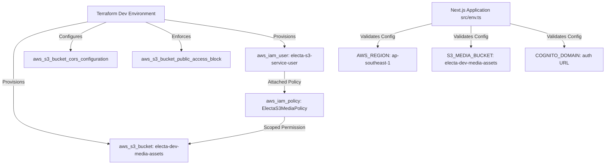

# Data Model & Infrastructure Schema: AWS S3 Media Storage Setup

**Feature**: `024-aws-s3-storage-setup` (Jira: [VS-41](https://the-three-devsketeers.atlassian.net/browse/VS-41))
**Date**: 2026-10-04

---

## 1. Cloud Infrastructure Entities (Terraform)

### Entity: `aws_s3_bucket.media`
Represents the dedicated Amazon S3 bucket for platform media storage.

| Attribute | Type | Description | Value / Constraint |
| :--- | :--- | :--- | :--- |
| `bucket` | String | Global unique bucket identifier | `${var.app_name}-${var.environment}-media-assets` |
| `force_destroy` | Boolean | Whether to allow non-empty bucket deletion | `true` in `dev`, `false` in `prod` |

### Entity: `aws_s3_bucket_server_side_encryption_configuration.media`
Enforces default server-side encryption for all objects deposited into the bucket.

| Attribute | Type | Description | Constraint |
| :--- | :--- | :--- | :--- |
| `sse_algorithm` | String | Encryption standard | `AES256` |

### Entity: `aws_s3_bucket_public_access_block.media`
Enforces AWS S3 Block Public Access controls.

| Attribute | Type | Value |
| :--- | :--- | :--- |
| `block_public_acls` | Boolean | `true` |
| `block_public_policy` | Boolean | `true` |
| `ignore_public_acls` | Boolean | `true` |
| `restrict_public_buckets` | Boolean | `true` |

### Entity: `aws_s3_bucket_cors_configuration.media`
Defines browser cross-origin upload and retrieval permissions.

| Attribute | Type | Description | Value |
| :--- | :--- | :--- | :--- |
| `allowed_headers` | List(String) | Permitted HTTP request headers | `["*"]` |
| `allowed_methods` | List(String) | Permitted HTTP methods | `["GET", "PUT", "POST", "HEAD"]` |
| `allowed_origins` | List(String) | Allowed web client origins | `["http://localhost:3000", "https://*.electa.app", "https://*.electa.com"]` |
| `expose_headers` | List(String) | Headers exposed to JavaScript | `["ETag"]` |
| `max_age_seconds` | Number | Preflight cache duration in seconds | `3000` |

### Entity: `aws_iam_user.s3_service_user`
Dedicated IAM principal for application service access.

| Attribute | Type | Description | Value |
| :--- | :--- | :--- | :--- |
| `name` | String | IAM user name | `${var.app_name}-s3-service-user` (e.g. `electa-s3-service-user`) |
| `tags` | Map(String) | Metadata tags | `ManagedBy = "Terraform"`, `Service = "MediaStorage"` |

### Entity: `aws_iam_policy.s3_media_policy`
Least-privilege policy document granting scoped actions on the bucket contents.

| Attribute | Type | Description | Value |
| :--- | :--- | :--- | :--- |
| `name` | String | Policy identifier | `ElectaS3MediaPolicy` |
| `policy` | JSON Document | Scoped IAM statement | Allowed actions: `s3:PutObject`, `s3:GetObject`, `s3:DeleteObject` on `arn:aws:s3:::${bucket_name}/*` |

### Entity: `aws_iam_access_key.s3_service_key`
API access credentials for application backend configuration.

| Attribute | Type | Description | Sensitive |
| :--- | :--- | :--- | :--- |
| `id` | String | AWS Access Key ID | No |
| `secret` | String | AWS Secret Access Key | Yes |

---

## 2. Application Environment Schema (Next.js / Zod)

The application validates the storage configuration in `src/env.ts` against the following schema:

```typescript
// Server-side environment schema
const serverStorageSchema = {
  AWS_REGION: z.string().min(1).default("ap-southeast-1"),
  S3_MEDIA_BUCKET: z.string().min(1).default("electa-dev-media-assets"),
  AWS_ACCESS_KEY_ID: z.string().min(1).optional(),
  AWS_SECRET_ACCESS_KEY: z.string().min(1).optional(),
};

// Client-side environment schema
const clientStorageSchema = {
  NEXT_PUBLIC_AWS_REGION: z.string().min(1).default("ap-southeast-1"),
  NEXT_PUBLIC_S3_MEDIA_BUCKET: z.string().min(1).default("electa-dev-media-assets"),
  NEXT_PUBLIC_COGNITO_DOMAIN: z.string().url().optional(),
};
```

### Relationship Diagram


