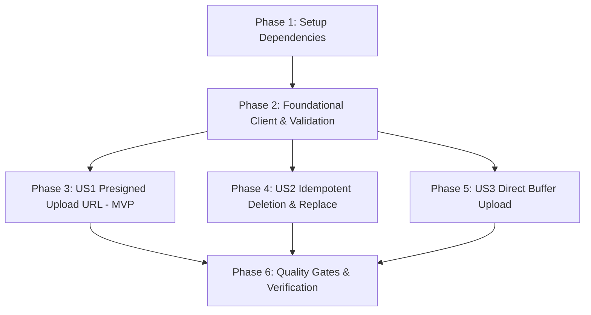

# Tasks: Core S3 Storage Service & Presigned URL Generator

**Feature Branch**: `feature/VS-42-s3-storage-service`  
**Input**: [plan.md](file:///c:/Users/russel/workspace/electa-workspace/electa-fullstack/specs/025-s3-storage-service/plan.md), [spec.md](file:///c:/Users/russel/workspace/electa-workspace/electa-fullstack/specs/025-s3-storage-service/spec.md), [data-model.md](file:///c:/Users/russel/workspace/electa-workspace/electa-fullstack/specs/025-s3-storage-service/data-model.md)  
**Status**: Completed

---

## Phase 1: Setup (Dependencies & Module Scaffold)

**Purpose**: Initialize external AWS SDK dependencies and directory scaffolding.

- [x] T001 Install AWS SDK v3 dependencies (`@aws-sdk/client-s3` and `@aws-sdk/s3-request-presigner`) in `electa-fullstack/package.json`
- [x] T002 [P] Create S3 module scaffold directory at `src/lib/s3/` and test directory at `tests/unit/storage/`

---

## Phase 2: Foundational (Blocking Prerequisites)

**Purpose**: Core client singleton and boundary validation utilities required by all S3 operations.

**⚠️ CRITICAL**: Foundational tasks MUST be completed before User Story implementation begins.

- [x] T003 Create S3 client singleton with region and credentials resolved from `@/env` in `src/lib/s3/client.ts`
- [x] T004 [P] Implement MIME whitelist, size boundaries, and Zod schemas (`presignedUploadRequestSchema`, `bufferUploadRequestSchema`, `deleteImageRequestSchema`, `replaceImageRequestSchema`) in `src/lib/s3/validation.ts`
- [x] T005 [P] Implement UUID collision-resistant key generator (`generateS3Key`) and canonical public URL builder (`getS3PublicUrl`) in `src/lib/s3/validation.ts`
- [x] T006 Write unit tests for Zod validation schemas, MIME whitelisting, and key sanitization in `tests/unit/storage/s3-validation.test.ts`

**Checkpoint**: Foundation verified. Validation and client singleton passing all unit tests.

---

## Phase 3: User Story 1 - Secure Presigned Upload URL Generation (Priority: P1) 🎯 MVP

**Goal**: Enable frontend forms to request short-lived (300s) presigned PUT URLs with strict MIME and size enforcement for direct-to-S3 uploads.

**Independent Test**: Request a presigned URL with valid parameters (`"banner.jpg"`, `"image/jpeg"`, `"events/banners"`). Verify that a valid presigned PUT URL and collision-resistant key are returned, and verify that disallowed MIME types (e.g. `"application/pdf"`) or oversized payloads are rejected immediately.

### Tests for User Story 1

> **NOTE: Write these tests FIRST, ensure they FAIL before implementation**

- [x] T007 [P] [US1] Write unit tests for `generatePresignedUploadUrl` mocking `@aws-sdk/s3-request-presigner` and verifying URL structure, expiration (300s), and rejection of invalid MIME/size in `tests/unit/storage/s3-storage-service.test.ts`

### Implementation for User Story 1

- [x] T008 [US1] Implement `generatePresignedUploadUrl` in `src/lib/s3/storage-service.ts` using `PutObjectCommand` and `getSignedUrl`
- [x] T009 [US1] Export `generatePresignedUploadUrl` and related types in `src/lib/s3/index.ts`

**Checkpoint**: User Story 1 is fully functional and independently testable via `npm run test:unit tests/unit/storage/s3-storage-service.test.ts`.

---

## Phase 4: User Story 2 - Idempotent Object Deletion and Asset Replacement (Priority: P2)

**Goal**: Provide cleanup and replacement utilities to delete obsolete images from S3 and avoid orphaned assets during media updates.

**Independent Test**: Dispatch `deleteImageFromS3(key)` and `replaceImage({ oldKey, newKey })` and verify that the deletion command succeeds and removes the targeted key from S3 without crashing on non-existent keys.

### Tests for User Story 2

> **NOTE: Write these tests FIRST, ensure they FAIL before implementation**

- [x] T010 [P] [US2] Write unit tests for `deleteImageFromS3` (idempotent 204 handling) and `replaceImage` (purging oldKey when newKey is provided) in `tests/unit/storage/s3-storage-service.test.ts`

### Implementation for User Story 2

- [x] T011 [US2] Implement idempotent `deleteImageFromS3` using `DeleteObjectCommand` in `src/lib/s3/storage-service.ts`
- [x] T012 [US2] Implement `replaceImage` utility with validation and atomic deletion of obsolete keys in `src/lib/s3/storage-service.ts`
- [x] T013 [US2] Export `deleteImageFromS3` and `replaceImage` in `src/lib/s3/index.ts`

**Checkpoint**: User Stories 1 and 2 are functional and independently testable.

---

## Phase 5: User Story 3 - Direct Server-Side Buffer Uploads (Priority: P3)

**Goal**: Enable server-side background services (QR code generation, canvas cards) to upload in-memory image buffers directly to S3.

**Independent Test**: Pass an image buffer (`image/png`) and target key to `uploadImageBuffer()` and confirm that the asset is written to S3 and returns the canonical public URL.

### Tests for User Story 3

> **NOTE: Write these tests FIRST, ensure they FAIL before implementation**

- [x] T014 [P] [US3] Write unit tests for `uploadImageBuffer` mocking `s3Client.send(PutObjectCommand)` with buffer payload in `tests/unit/storage/s3-storage-service.test.ts`

### Implementation for User Story 3

- [x] T015 [US3] Implement `uploadImageBuffer` in `src/lib/s3/storage-service.ts` validating payload against `bufferUploadRequestSchema` and executing `PutObjectCommand`
- [x] T016 [US3] Export `uploadImageBuffer` in `src/lib/s3/index.ts`

**Checkpoint**: All three user stories are functional and independently testable.

---

## Phase 6: Polish & Quality Gates

**Purpose**: Cross-cutting quality verification, typecheck, linting, and Constitution compliance.

- [x] T017 [P] Run full storage unit test suite via `npm run test:unit tests/unit/storage/` and verify 100% pass rate
- [x] T018 Run strict TypeScript check via `npm run typecheck` and ensure 0 errors
- [x] T019 Run ESLint code style check via `npm run lint` and ensure 0 violations
- [x] T020 Audit implementation against Electa Constitution (§I–§VI) and verify zero direct `process.env` access via `env-validator`

---

## Dependencies & Execution Order

### Phase Dependencies

### User Story Dependencies

- **User Story 1 (P1 MVP)**: Depends on Phase 2 (Client & Validation). No dependency on US2 or US3.
- **User Story 2 (P2)**: Depends on Phase 2 (Client & Validation). Can run in parallel with US1.
- **User Story 3 (P3)**: Depends on Phase 2 (Client & Validation). Can run in parallel with US1/US2.

### Parallel Opportunities

- **T004 & T005**: Zod schemas and key sanitization functions implemented in `src/lib/s3/validation.ts`.
- **T007, T010, T014**: Vitest unit test suites for US1, US2, and US3 executed in parallel.
- **T017, T018, T019**: Quality checks verified in Phase 6.

---

## Implementation Strategy

### MVP First (User Story 1 Only)

1. Complete Phase 1: Install `@aws-sdk/client-s3` and `@aws-sdk/s3-request-presigner`.
2. Complete Phase 2: Foundational client singleton (`client.ts`) and validation (`validation.ts`).
3. Complete Phase 3: Implement `generatePresignedUploadUrl()` in `storage-service.ts`.
4. **STOP and VALIDATE**: Run `npm run test:unit tests/unit/storage/` to verify US1 independently.

### Incremental Delivery

1. Complete Setup + Foundational -> Foundation ready.
2. Add User Story 1 (Presigned URL generator) -> Test independently -> MVP ready!
3. Add User Story 2 (Deletion & Replacement) -> Test independently.
4. Add User Story 3 (Buffer uploads) -> Test independently.
5. Final Quality Gates: Typecheck, lint, and Constitution audit.
