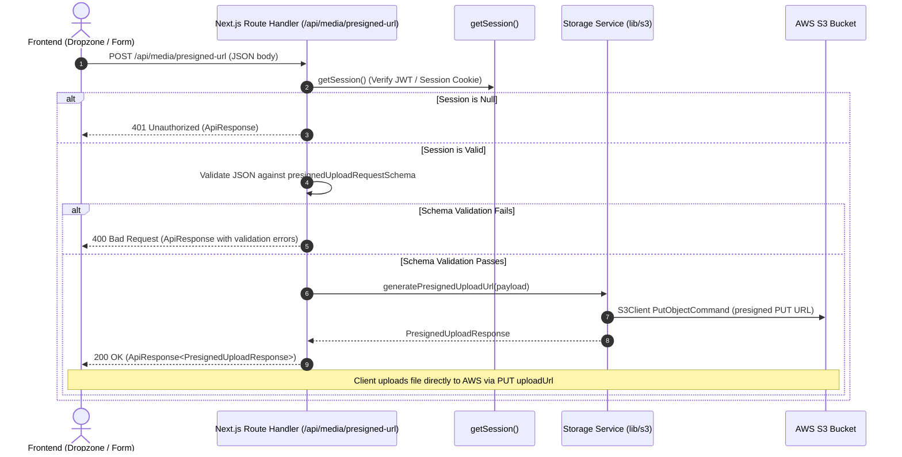

# Data Model & Interface Schemas: Authenticated API Route Handlers for Media Operations (VS-43)

**Tracking Issue**: [VS-43](https://the-three-devsketeers.atlassian.net/browse/VS-43)  
**Parent Epic**: [VS-40](https://the-three-devsketeers.atlassian.net/browse/VS-40) ([Electa] Media & Image Management via AWS S3)  
**Feature Branch**: `feature/VS-43-media-route-handlers`  
**Date**: 2026-10-05  

---

## 1. Domain Entities & Schemas

### 1.1 `PresignedUploadRequest` (Zod Schema: `presignedUploadRequestSchema`)

Represents the client input payload sent to `POST /api/media/presigned-url`:

| Field | Type | Validation Rules | Description |
| :--- | :--- | :--- | :--- |
| `fileName` | `string` | Min 1, max 255 chars; no slashes (`/`, `\`) or `..` | Original client file name (e.g. `"banner.png"`). Sanitized before S3 key creation. |
| `contentType` | `enum` | Must be one of: `"image/jpeg"`, `"image/png"`, `"image/webp"` | MIME type of the asset. Non-image types rejected immediately. |
| `folder` | `string` | Regex `^[a-zA-Z0-9_\-\/]+$`, no `..` | Target folder prefix in S3 (e.g. `"events/banners"`, `"contestants/avatars"`). |
| `maxSizeBytes` | `number` (optional) | Positive integer; max `10485760` (10MB) | Declared file size ceiling in bytes. Default 5MB. |

---

### 1.2 `PresignedUploadResponse`

The payload returned within `ApiResponse.data` on successful presigned URL generation:

```typescript
export interface PresignedUploadResponse {
  uploadUrl: string;       // AWS S3 presigned PUT URL with 300s TTL
  key: string;             // Collision-resistant S3 object key (e.g. "events/banners/<uuid>-banner.png")
  publicUrl: string;       // Virtual-hosted HTTPS public asset URL
  expiresIn: number;       // Expiration window in seconds (300)
  contentType: "image/jpeg" | "image/png" | "image/webp";
}
```

---

### 1.3 `DeleteImageRequest` (Zod Schema: `deleteImageRequestSchema`)

Represents the client input payload sent to `DELETE /api/media/delete`:

| Field | Type | Validation Rules | Description |
| :--- | :--- | :--- | :--- |
| `key` | `string` | Min 1 char, regex `^[a-zA-Z0-9_\-\/\.]+$`, no `..` | Target S3 object key to delete (e.g. `"events/banners/abc-banner.webp"`). |

---

### 1.4 `DeleteImageResponse`

The payload returned within `ApiResponse.data` on successful object deletion:

```typescript
export interface DeleteImageResponse {
  success: boolean;        // true
  key: string;             // The key that was purged from S3
}
```

---

### 1.5 `ApiResponse<T>` Standard Envelope

Standard response format mandated by VoteSphere Constitution §II:

```typescript
export interface ApiResponse<T = unknown> {
  success: boolean;        // true for 2xx responses, false for 4xx/5xx
  data?: T;                // Present on success
  error?: string;          // Error message string present on failure
  timestamp: string;       // ISO 8601 timestamp (e.g. "2026-10-05T20:25:00.000Z")
}
```

---

## 2. Entity Lifecycle & Interaction Flow


