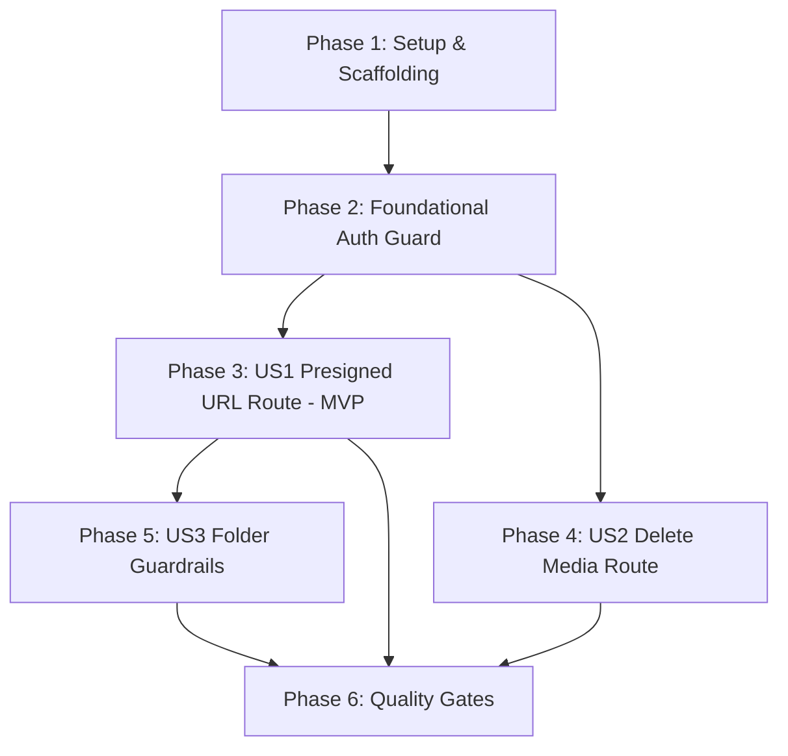

# Tasks: Authenticated API Route Handlers for Media Operations (VS-43)

**Feature Branch**: `feature/VS-43-media-route-handlers`  
**Tracking Issue**: [VS-43](https://the-three-devsketeers.atlassian.net/browse/VS-43)  
**Parent Epic**: [VS-40](https://the-three-devsketeers.atlassian.net/browse/VS-40)  
**Input**: [spec.md](spec.md), [plan.md](plan.md), [research.md](research.md), [data-model.md](data-model.md), [contracts/](contracts/)  
**Status**: Completed

---

## Phase 1: Setup (Scaffolding & Prerequisites)

**Purpose**: Initialize directory structure for media route handlers and test suites.

- [x] T001 Scaffold route handler directories at `src/app/api/media/presigned-url/` and `src/app/api/media/delete/`
- [x] T002 [P] Verify imports and exports from `@/lib/s3`, `@/lib/auth/get-session`, and `@/lib/api/response`

---

## Phase 2: Foundational (Blocking Prerequisites)

**Purpose**: Core validation and helper logic required across media route handlers.

**⚠️ CRITICAL**: Foundational tasks MUST be completed before user story route implementation begins.

- [x] T003 [P] Implement role-based authorization guard helper in `src/app/api/media/auth-guard.ts` to verify `ORGANIZER` and `ADMIN` privileges

**Checkpoint**: Foundation ready — route handler implementation can now proceed.

---

## Phase 3: User Story 1 - Authenticated Presigned URL Generation Endpoint (Priority: P1) 🎯 MVP

**Goal**: Expose `POST /api/media/presigned-url` to authenticate user sessions, validate upload request parameters against `presignedUploadRequestSchema`, generate presigned S3 PUT URLs with 300s TTL, and return typed `ApiResponse<PresignedUploadResponse>`.

**Independent Test**: Send authenticated `POST` request with valid payload (`"banner.jpg"`, `"image/jpeg"`, `"events/banners"`). Verify HTTP 200 with presigned PUT URL and collision-resistant key. Verify HTTP 401 when unauthenticated, and HTTP 400 for disallowed MIME types (e.g. `"application/pdf"`) or invalid JSON.

### Tests for User Story 1 (TDD Red Phase)

> **NOTE: Write these tests FIRST and ensure they FAIL before implementation**

- [x] T004 [P] [US1] Write unit tests mocking `getSession` and `generatePresignedUploadUrl` covering 401 Unauthorized, 400 Bad Request (invalid JSON, disallowed MIME, oversized payload), 200 OK (valid descriptor), and 500 error handling in `tests/unit/api/media-presigned-url-route.test.ts`

### Implementation for User Story 1 (Green Phase)

- [x] T005 [US1] Implement `POST` route handler in `src/app/api/media/presigned-url/route.ts` integrating `getSession()`, `presignedUploadRequestSchema`, and `generatePresignedUploadUrl()` with `apiSuccess` / `apiError` envelopes

**Checkpoint**: User Story 1 is fully functional and independently testable via `npm run test:unit tests/unit/api/media-presigned-url-route.test.ts`.

---

## Phase 4: User Story 2 - Authenticated Media Object Deletion Endpoint (Priority: P2)

**Goal**: Expose `DELETE /api/media/delete` to enforce organizer/admin authorization, validate S3 object keys, idempotently delete assets from storage, and return typed `ApiResponse<DeleteImageResponse>`.

**Independent Test**: Send authenticated `DELETE` request with organizer session and valid key. Verify HTTP 200 with `{ success: true, key }`. Verify HTTP 401 when unauthenticated, HTTP 403 for unauthorized voter roles, and HTTP 400 for empty or malformed keys.

### Tests for User Story 2 (TDD Red Phase)

> **NOTE: Write these tests FIRST and ensure they FAIL before implementation**

- [x] T006 [P] [US2] Write unit tests mocking `getSession` and `deleteImageFromS3` covering 401 Unauthorized, 403 Forbidden (non-organizer role), 400 Bad Request (malformed key/JSON), 200 OK (successful idempotent deletion), and 500 error handling in `tests/unit/api/media-delete-route.test.ts`

### Implementation for User Story 2 (Green Phase)

- [x] T007 [US2] Implement `DELETE` route handler in `src/app/api/media/delete/route.ts` enforcing organizer role authorization, Zod validation via `deleteImageRequestSchema`, and idempotent S3 deletion via `deleteImageFromS3()`

**Checkpoint**: User Stories 1 and 2 are both functional and testable independently.

---

## Phase 5: User Story 3 - Role-Based Authorization & Path Prefix Guardrails (Priority: P3)

**Goal**: Enforce folder prefix boundaries on upload requests to prevent unprivileged generation of upload credentials for system directories.

**Independent Test**: Send upload request specifying unauthorized or system folder paths without admin privileges and verify rejection.

### Tests for User Story 3

- [x] T008 [P] [US3] Add unit test cases in `tests/unit/api/media-presigned-url-route.test.ts` verifying rejection of system folder uploads by standard users

### Implementation for User Story 3

- [x] T009 [US3] Add folder namespace guard logic in `src/app/api/media/presigned-url/route.ts` restricting `"system/generated"` to administrative sessions

**Checkpoint**: All three user stories are complete and secured.

---

## Phase 6: Polish & Quality Gates

**Purpose**: Static analysis, type checking, linting, and Constitution compliance verification.

- [x] T010 [P] Run full media route handler test suites via `npm run test:unit tests/unit/api/media-*.test.ts` and verify 100% pass rate
- [x] T011 Run strict TypeScript typecheck via `npm run typecheck` and ensure 0 errors
- [x] T012 Run ESLint code style check via `npm run lint` and ensure 0 violations
- [x] T013 Audit implementation against Electa Constitution (§I–§VI) and verify zero raw `process.env` access via `env-validator`

---

## Dependencies & Execution Order

### Phase Dependencies

### User Story Dependencies

- **User Story 1 (P1 MVP)**: Depends on Phase 1 & 2. Completely independent of US2.
- **User Story 2 (P2)**: Depends on Phase 1 & 2. Can be developed in parallel with US1.
- **User Story 3 (P3)**: Extends US1 with additional folder authorization rules.

### Parallel Opportunities

- **T002 & T003**: Scaffolding and auth helper can run in parallel.
- **T004 & T006**: Vitest test suites for US1 and US2 can be authored in parallel.
- **T005 & T007**: Route handler files are completely separate (`presigned-url/route.ts` vs `delete/route.ts`) and can be implemented concurrently by separate subagents/developers.
- **T010, T011, T012**: Quality gates in Phase 6 run independently.

---

## Implementation Strategy

### MVP First (User Story 1 Only)

1. Complete Phase 1 (Scaffolding) and Phase 2 (Foundational helper).
2. Author unit test `tests/unit/api/media-presigned-url-route.test.ts` (TDD Red).
3. Implement `src/app/api/media/presigned-url/route.ts` (Green).
4. **STOP and VALIDATE**: Run `npm run test:unit tests/unit/api/media-presigned-url-route.test.ts` to confirm MVP functionality.

### Incremental Delivery

1. Setup + Foundational -> Scaffolding ready.
2. User Story 1 (Presigned URL Route) -> MVP delivered. Frontend dropzone can now upload!
3. User Story 2 (Delete Route) -> Media cleanup and asset replacement delivered.
4. User Story 3 (Guardrails) -> System namespace protection delivered.
5. Phase 6 (Quality Gates) -> Full test, typecheck, and lint verification.
