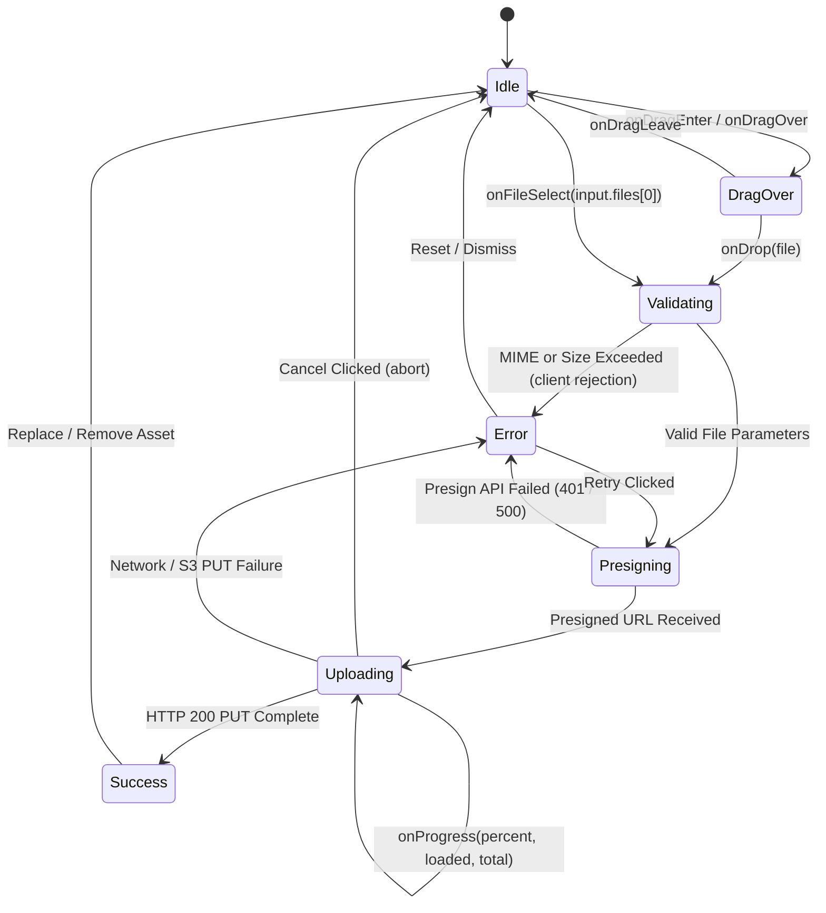
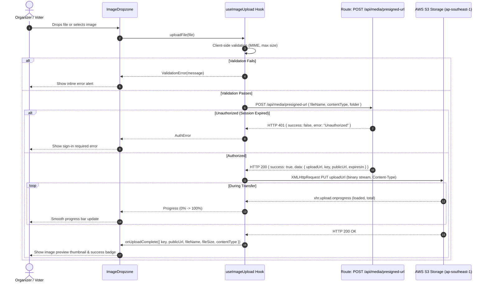

# Data Model & Component Contracts: Reusable Image Upload & Dropzone Component (VS-45)

**Feature**: [spec.md](spec.md) | **Plan**: [plan.md](plan.md)  
**Parent Epic**: [VS-40](https://the-three-devsketeers.atlassian.net/browse/VS-40)  
**Date**: 2026-10-07  
**Status**: Completed  

---

## 1. Component State Machine



---

## 2. Direct-to-S3 Upload Sequence Diagram



---

## 3. TypeScript Interfaces & Schemas

### 3.1 Component Props Interface (`ImageDropzoneProps`)

```typescript
export type MediaFolder = 'events/banners' | 'events/logos' | 'contestants/avatars' | 'sponsors';

export interface UploadedMedia {
  key: string;
  publicUrl: string;
  fileName: string;
  fileSize: number;
  contentType: string;
}

export interface UploadError {
  code: 'FILE_TOO_LARGE' | 'INVALID_MIME_TYPE' | 'PRESIGN_FAILED' | 'UPLOAD_FAILED' | 'ABORTED' | 'UNAUTHORIZED';
  message: string;
  retryable: boolean;
}

export interface ImageDropzoneProps {
  /** Target S3 storage folder category */
  folder: MediaFolder;
  /** Maximum allowed file size in bytes (defaults: 5MB for avatars, 10MB for banners) */
  maxSizeBytes?: number;
  /** Allowed MIME types (defaults to image/jpeg, image/png, image/webp) */
  allowedMimeTypes?: string[];
  /** Existing image URL to render as initial thumbnail */
  initialPreviewUrl?: string;
  /** Callback emitted when S3 upload finishes successfully */
  onUploadComplete: (asset: UploadedMedia) => void;
  /** Optional callback emitted on error */
  onError?: (error: UploadError) => void;
  /** Optional callback emitted when user clicks remove */
  onRemove?: () => void;
  /** Disabled interaction state */
  disabled?: boolean;
  /** Accessible label description */
  label?: string;
  /** Helper text displayed below dropzone */
  helperText?: string;
  /** Additional CSS class names */
  className?: string;
}
```

### 3.2 Upload State Interface

```typescript
export type UploadStatus = 
  | 'idle'
  | 'validating'
  | 'presigning'
  | 'uploading'
  | 'success'
  | 'error';

export interface UploadState {
  status: UploadStatus;
  progressPercent: number;
  loadedBytes: number;
  totalBytes: number;
  previewUrl: string | null;
  uploadedAsset: UploadedMedia | null;
  error: UploadError | null;
}
```
