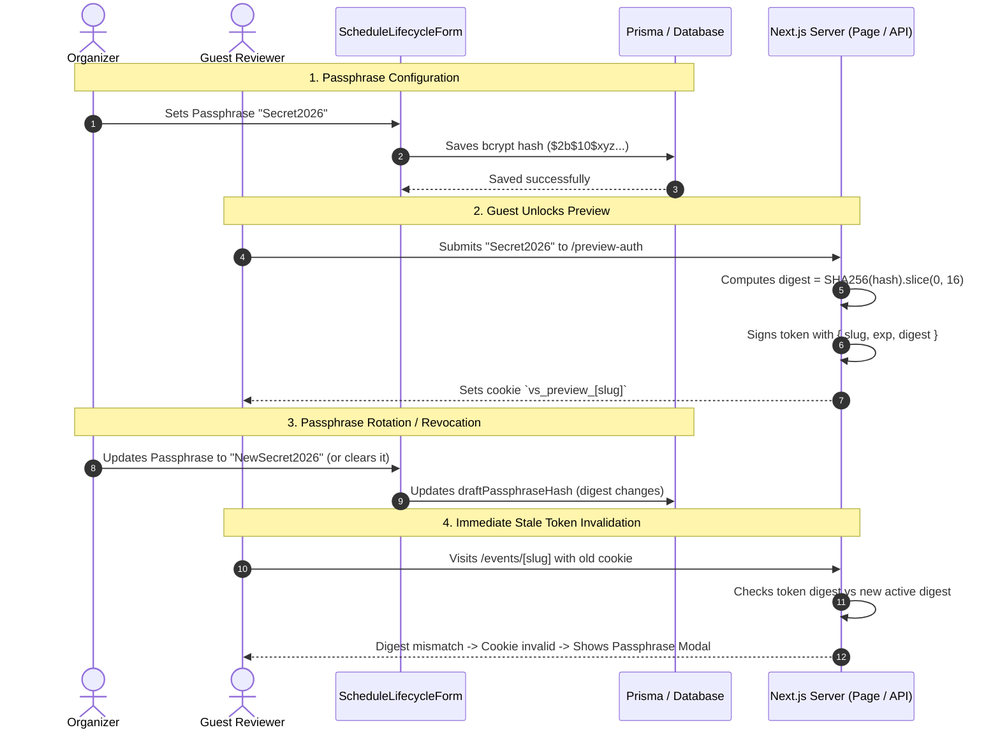

# Data Model: Draft Event Passphrase Protection & Access Control

**Feature**: `028-draft-passphrase-protection`  
**Spec**: [spec.md](./spec.md)  
**Parent Ticket**: [VS-80](https://the-three-devsketeers.atlassian.net/browse/VS-80)

---

## 1. Entities & Schemas

### 1.1 Event Security Entity (`Event` in Prisma)

The single source of truth for event lifecycle and ownership in PostgreSQL.

```prisma
model Event {
  id                  String                 @id @default(uuid())
  slug                String                 @unique
  title               String
  description         String
  bannerUrl           String
  startsAt            DateTime
  endsAt              DateTime
  publicationStatus   EventPublicationStatus @default(DRAFT)
  draftPassphraseHash String?                // Salted hash of the draft preview passphrase
  organizerId         String                 // Foreign reference to User.id (Owner)
  createdAt           DateTime               @default(now())
  updatedAt           DateTime               @updatedAt
  ...
}
```

### 1.2 Public Event Transfer Object (`PublicEventDto`)

Public data transfer object passed from Server Components to client preview components.

```typescript
export interface PublicEventDto {
  id: string;
  slug: string;
  title: string;
  description: string;
  bannerUrl: string;
  startsAt: string;
  endsAt: string;
  serverTime: string;
  operationalState: EventOperationalState; // "Draft" | "Scheduled" | "Active" | "Closed"
  showResultsOnClose: boolean;
  isFreeVotingEnabled?: boolean;
  dailyFreeVoteLimit?: number;
  organizerId?: string; // Included for server-side & client-side ownership verification
  contestants: ContestantDto[];
}
```

### 1.3 Preview Token Payload (`PreviewTokenPayload`)

HMAC-signed payload stored in the `vs_preview_[slug]` cookie.

```typescript
export interface PreviewTokenPayload {
  slug: string; // Target event slug
  exp: number; // Expiration Unix timestamp in milliseconds
  digest?: string; // SHA-256 digest substring of active draftPassphraseHash
}
```

### 1.4 Event Audit Log (`EventAuditLog`)

Tracks administrative changes to draft security configurations.

```typescript
export interface EventAuditLogEntry {
  id: string;
  eventId: string;
  action: "UPDATE_SCHEDULE_LIFECYCLE" | "UPDATE_DRAFT_PASSPHRASE";
  changedBy: string; // organizerId
  previousVal: {
    publicationStatus?: string;
    hasPassphrase?: boolean;
  };
  newVal: {
    publicationStatus?: string;
    hasPassphrase?: boolean;
  };
  reason: string | null;
  createdAt: string;
}
```

---

## 2. State Transition & Authorization Matrix

| Visitor Identity                                                     | Event State | Passphrase Configured | Access Result                                                              | UI / Response                                           |
| :------------------------------------------------------------------- | :---------- | :-------------------- | :------------------------------------------------------------------------- | :------------------------------------------------------ |
| **Verified Event Owner** (`session.userId === event.organizerId`)    | `Draft`     | Yes / No              | **Granted** (Owner bypass)                                                 | Full draft preview with `accessMode="organizer"` banner |
| **Authenticated Non-Owner** (`session.userId !== event.organizerId`) | `Draft`     | Yes                   | **Challenged**                                                             | Displays `DraftPassphraseModal`                         |
| **Authenticated Non-Owner** (`session.userId !== event.organizerId`) | `Draft`     | No                    | **Refused**                                                                | Informational "Private Draft" screen (403/404)          |
| **Guest Reviewer** (with valid matching preview cookie)              | `Draft`     | Yes                   | **Granted** (Guest bypass)                                                 | Draft preview with `accessMode="guest"` banner          |
| **Guest Reviewer** (with expired or mismatched preview cookie)       | `Draft`     | Yes                   | **Challenged**                                                             | Displays `DraftPassphraseModal`                         |
| **Anonymous Public Visitor** (no session, no cookie)                 | `Draft`     | Yes                   | **Challenged**                                                             | Displays `DraftPassphraseModal`                         |
| **Anonymous Public Visitor** (no session, no cookie)                 | `Draft`     | No                    | **Refused**                                                                | "Event Not Found" / Private Draft screen                |
| **API Client** (`GET /api/events/[slug]`)                            | `Draft`     | Any                   | **404 Not Found** (unless owner session or valid preview cookie presented) | Standard `ApiResponse` error                            |
| **Any Visitor**                                                      | `Published` | Irrelevant            | **Granted** (Public access)                                                | Standard public voting event view                       |

---

## 3. Cryptographic Invalidation Flow


